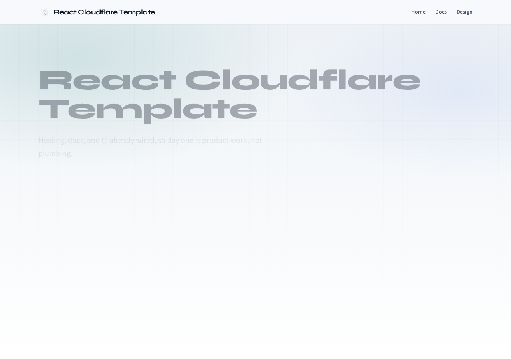
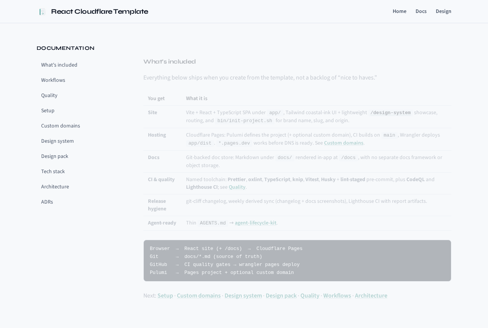
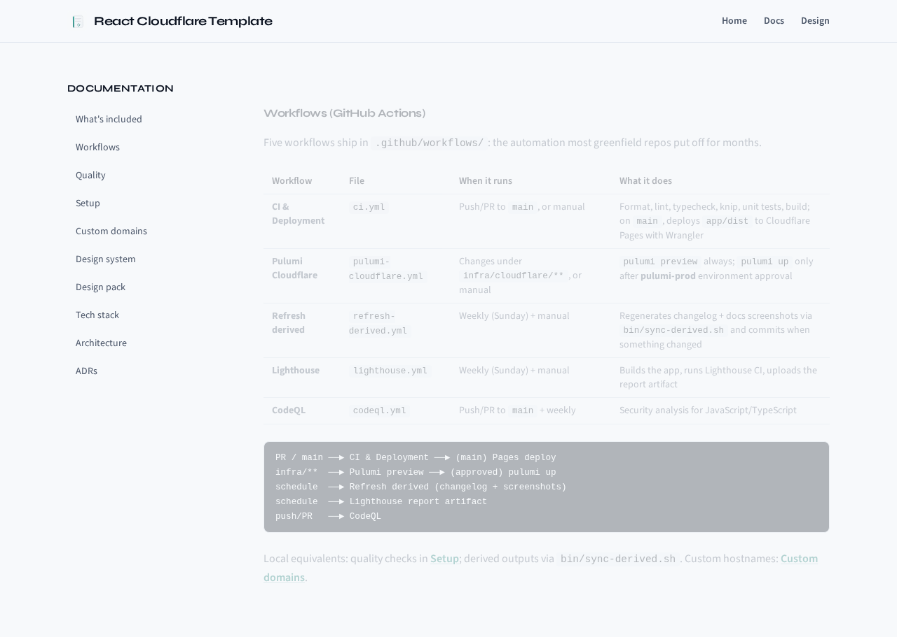

# React Cloudflare Template

**From empty repo to a live Cloudflare Pages site, so day one is product work, not plumbing.**

A GitHub template for a **React + TypeScript + Tailwind** SPA on **Cloudflare Pages**, with docs-in-app, Pulumi, CI deploy, and the quality toolchain already in place.



```bash
curl -fsSL https://raw.githubusercontent.com/mzworthington/react-cloudflare-template/main/scripts/create.sh | bash
```

Prompts for name/slug, creates the GitHub repo from this template, brands it, and can run `bin/setup-dev-env.sh`. Prefer `| bash` (not `| sh`).

Or click **Use this template** on GitHub, then:

```bash
bin/init-project.sh   # prompts for name / slug
bin/setup-dev-env.sh && cd app && pnpm dev
```

---

## On the box

Everything below is included when you create from the template, not a backlog of “nice to haves.”



| You get             | What it is                                                                                                                                                          |
| ------------------- | ------------------------------------------------------------------------------------------------------------------------------------------------------------------- |
| **Site**            | A Vite + React + TypeScript SPA under `app/`, with a Tailwind starter UI, routing, and `bin/init-project.sh` to set brand name, slug, and origin.                   |
| **Hosting**         | Cloudflare Pages: Pulumi defines the project (+ optional custom domain), CI builds on `main`, Wrangler deploys `app/dist`. `*.pages.dev` works before DNS is ready. |
| **Docs**            | A git-backed doc store: Markdown under `docs/` (setup, architecture, ADRs) rendered in-app at `/docs`, with no separate docs framework or object storage.           |
| **CI & quality**    | **Prettier**, **oxlint**, **TypeScript**, **knip**, **Vitest**, **Husky** + **lint-staged**, **CodeQL**, **Lighthouse CI**; see [Quality](#quality).                |
| **Release hygiene** | git-cliff changelog, weekly derived sync (changelog + docs screenshots), and a Lighthouse CI workflow with report artifacts.                                        |
| **Agent-ready**     | Thin `AGENTS.md` pointing at [agent-lifecycle-kit](https://github.com/mzworthington/agent-lifecycle-kit) so coding agents share the same conventions.               |

```text
Browser  →  React site (+ /docs)  →  Cloudflare Pages
Git      →  docs/*.md (source of truth)
GitHub   →  CI quality gates → wrangler pages deploy
Pulumi   →  Pages project + optional custom domain
```

Stack: **Vite 8 · React 19 · TypeScript 7 · Tailwind 4 · pnpm · Mise**.

---

## Workflows (GitHub Actions)

Five workflows ship in `.github/workflows/`: the automation most greenfield repos put off for months.



| Workflow              | File                                                               | When it runs                                   | What it does                                                                                                      |
| --------------------- | ------------------------------------------------------------------ | ---------------------------------------------- | ----------------------------------------------------------------------------------------------------------------- |
| **CI & Deployment**   | [`ci.yml`](.github/workflows/ci.yml)                               | Push/PR to `main`, or manual                   | Format, lint, typecheck, knip, unit tests, build; on `main`, deploys `app/dist` to Cloudflare Pages with Wrangler |
| **Pulumi Cloudflare** | [`pulumi-cloudflare.yml`](.github/workflows/pulumi-cloudflare.yml) | Changes under `infra/cloudflare/**`, or manual | `pulumi preview` always; `pulumi up` only after **pulumi-prod** environment approval                              |
| **Refresh derived**   | [`refresh-derived.yml`](.github/workflows/refresh-derived.yml)     | Weekly (Sunday) + manual                       | Regenerates changelog + docs screenshots via `bin/sync-derived.sh` and commits when something changed             |
| **Lighthouse**        | [`lighthouse.yml`](.github/workflows/lighthouse.yml)               | Weekly (Sunday) + manual                       | Builds the app, runs Lighthouse CI, uploads the report artifact                                                   |
| **CodeQL**            | [`codeql.yml`](.github/workflows/codeql.yml)                       | Push/PR to `main` + weekly                     | Security analysis for JavaScript/TypeScript                                                                       |

```text
PR / main ──► CI & Deployment ──► (main) Pages deploy
infra/**  ──► Pulumi preview ──► (approved) pulumi up
schedule  ──► Refresh derived (changelog + screenshots)
schedule  ──► Lighthouse report artifact
push/PR   ──► CodeQL
```

---

## Quality

Same idea as the in-app [Quality](docs/quality.md) doc: **Prettier**, **oxlint**, **TypeScript**, **knip**, **Vitest**, **Husky** / **lint-staged**, **CodeQL**, and **Lighthouse CI**: fail fast locally, enforce on every PR, schedule the heavier checks.

| Tool                                 | What it does                                       | When                                       |
| ------------------------------------ | -------------------------------------------------- | ------------------------------------------ |
| **Prettier** (+ Tailwind class sort) | Format app, docs, and workflow YAML                | Local, lint-staged, CI                     |
| **oxlint**                           | Lint `src/`                                        | Local, pre-commit, CI                      |
| **TypeScript** (`tsc --noEmit`)      | Typecheck                                          | Local, pre-commit, CI                      |
| **knip**                             | Unused files, exports, deps (`app/knip.json`)      | Local, CI                                  |
| **Vitest** + Testing Library         | Unit / component tests                             | Local, CI                                  |
| **Vite** build                       | Production bundle                                  | Local, CI (required before deploy)         |
| **Husky** + **lint-staged**          | Pre-commit: Prettier → format check → oxlint → tsc | Staged `app/` / `docs/` changes            |
| **CodeQL**                           | Security analysis                                  | Push/PR + weekly                           |
| **Lighthouse CI**                    | Perf / a11y / SEO (`app/lighthouserc.cjs`)         | Weekly + manual; a11y hard-fails below 0.9 |
| **Playwright**                       | Docs/README screenshots (`pnpm record:docs-media`) | Manual / weekly derived sync               |

```bash
cd app
pnpm format:check && pnpm lint && pnpm typecheck && pnpm knip && pnpm test && pnpm build
```

---

## Why this instead of `npm create vite`?

Vite gives you a blank app. This template is the baseline so day one is product work, not plumbing:

| You get                                               | So you don't have to                               |
| ----------------------------------------------------- | -------------------------------------------------- |
| Pages deploy on `main` via Wrangler                   | Hand-roll GitHub Actions + tokens                  |
| Pulumi for the Pages project + optional custom domain | Click-ops DNS and project settings                 |
| Docs in git, browsable in the app                     | Bolt on a separate docs site later                 |
| Prettier, oxlint, Vitest, knip, Husky, CodeQL         | Debate the toolchain on day one                    |
| Changelog + Lighthouse workflows                      | Discover gaps after the first launch               |
| `scripts/create.sh` + `bin/init-project.sh`           | Search-replace `react-cloudflare-template` by hand |

---

## Nothing → live site

1. **Create** from the template (prompts for name/slug):

   ```bash
   curl -fsSL https://raw.githubusercontent.com/mzworthington/react-cloudflare-template/main/scripts/create.sh | bash
   ```

   Or click **Use this template** on GitHub, clone, then brand:

   ```bash
   bin/init-project.sh   # prompts; or pass --name / --slug / --origin
   ```

2. **Run locally**

   ```bash
   bin/setup-dev-env.sh
   cd app && pnpm dev
   ```

3. **Bootstrap Cloudflare** (API token with Pages Edit; Zone DNS Edit if using a custom domain).
   Hostnames and tokens stay out of the template; use local `.env` or GitHub vars.
   Full walkthrough: [docs/custom-domains.md](docs/custom-domains.md).

   ```bash
   cp .env.example .env   # set DOMAIN, PAGES_HOSTNAMES, CLOUDFLARE_API_TOKEN, …
   # Optional Bitwarden: export BWS_ACCESS_TOKEN=... BWS_PROJECT_ID=...
   bin/setup-cloudflare-hosting.sh
   ```

4. **Apply infra**: `cd infra/cloudflare && pulumi up`, or merge to `main` and approve the **pulumi-prod** GitHub Environment.
5. **Deploy**: push to `main`; CI builds and runs `wrangler pages deploy`.
6. Open `https://<PAGES_PROJECT_NAME>.pages.dev` (custom hostnames after DNS is active).

`bin/init-project.sh` updates `app/src/siteConfig.ts`, `wrangler.toml`, package names, HTML title/description, and the CI Pages fallback. Re-run with `--force` to change again.

Full detail: [docs/setup.md](docs/setup.md) · [docs/custom-domains.md](docs/custom-domains.md) · [docs/quality.md](docs/quality.md) · secrets: [docs/cloudflare-secrets.md](docs/cloudflare-secrets.md) · architecture: [docs/architecture.md](docs/architecture.md)

---

## Scripts

| Command                              | Purpose                                     |
| ------------------------------------ | ------------------------------------------- |
| `scripts/create.sh` (curl \| bash)   | Create GitHub repo from template + brand    |
| `bin/init-project.sh`                | Customize slug, brand, description, origin  |
| `cd app && pnpm dev`                 | Dev server                                  |
| `cd app && pnpm knip`                | Unused files / exports / deps               |
| `cd app && pnpm test` / `pnpm build` | Unit tests / production build               |
| `cd app && pnpm test:lighthouse`     | Lighthouse CI (after build)                 |
| `cd app && pnpm record:docs-media`   | Capture docs screenshots                    |
| `bin/sync-derived.sh`                | Changelog + docs media; commit when changed |

---

## Styling

The starter ships a light Tailwind coastal-ink system (Syne + Source Sans 3, tokens and named recipes in `app/src/index.css`), a **design pack** under [`design-pack/`](design-pack/) (favicon, logos, PWA icons, `social-share.png`), and a lightweight in-app showcase at `/design-system`. Written guide: [`docs/design-system.md`](docs/design-system.md). Treat the shell as a demo — rebrand colors, type, and the mark for your product once the plumbing is yours.

---

## Who it's for

Side projects, internal tools, and product MVPs that should look and behave like they belong in production from the first push, especially if Cloudflare Pages is already your hosting default.
