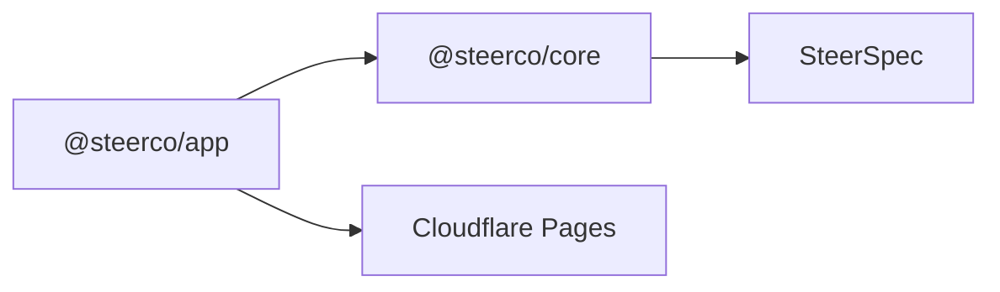

# 0002. Tech stack for SteerCo

## Context and Problem Statement

SteerCo needs a stack that supports a local-first SPA, a strict SteerSpec domain model, and later OAuth connectors - while staying familiar to the ArchLens / Cloudflare portfolio without sharing UI chrome.

## Decision Drivers

- Pure domain core separable from React
- Fast local DX for Slice 1 demos
- Reuse proven Pages + Pulumi hosting patterns
- Distinct executive visual language (not ArchLens tokens)

## Considered Options

- Option A: Next.js App Router for the whole product
- Option B: React + Vite SPA + Zod core package (`@steerco/core`)
- Option C: Share ArchLens canvas packages and theme

## Decision Outcome

Chosen option: **Option B**.

- TypeScript monorepo with `pnpm` + `mise`
- React 19 + Vite + Tailwind for `@steerco/app`
- Zod-based `@steerco/core` for SteerSpec
- Vitest + Playwright
- Cloudflare Pages for hosting ([ADR 0001](./0001-cloudflare-pages-pulumi-wrangler.md))
- No Next.js for Slice 1

### Consequences

- Good, because domain stays framework-free and testable
- Good, because hosting patterns match the portfolio
- Bad, because some infra patterns are duplicated vs ArchLens (accepted)

## Architecture sketch

## Links

- [Tech stack](../tech-stack.md)
- Plan notes: `plan/docs/TECH_STACK.md`
