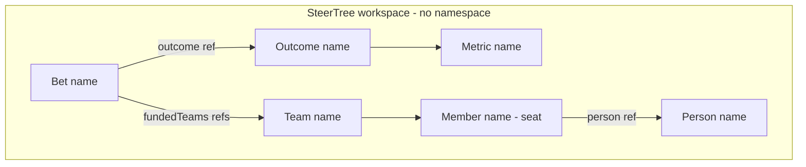

# 0006. SteerSpec entities use name and kinded refs

## Context and Problem Statement

SteerSpec is the versionable investment contract for a workspace: outcomes, bets, teams, capacity seats, and decision notes linked together in one `steertree.yaml`. Identity and cross-links are hard to reverse once samples, parsers, and git workflows settle. We need a durable convention that stays human-editable, supports people sitting across teams with time windows and discipline mix, and does not become an HR directory or a multi-file catalog with namespaces.

## Decision Drivers

- Hard to reverse: identity and cross-links are the public shape of SteerSpec
- Diff-friendly, git-readable names executives and engineers can both recognise
- Clear split between a **person** (human) and a **member** (seat / capacity line on a team)
- One workspace file is already the isolation boundary - no extra namespace layer
- Keep SteerSpec intent + references; foreign directories stay on `externalRefs`

## Considered Options

- Option A: Opaque prefixed tokens per record, with parallel `*Id`-style link fields and a separate person token for multi-team humans
- Option B: Entities carry a stable `name`; links are kinded refs `[<kind>:]<name>` (no namespace); Person vs Member are distinct kinds
- Option C: One descriptor file per entity, resolved across a multi-file tree

## Decision Outcome

Chosen option: **Option B**.

### Naming

- Every addressable SteerSpec entity has a `name`: DNS-label style `^[a-z0-9][a-z0-9-]*$`.
- Uniqueness is **`(kind, name)` within one SteerTree workspace**.
- Human-facing labels use `title` (and free-text member job `title` where defined). Prefer not inventing a second display-name field when `title` suffices.

### Entity kinds (initial)

| Kind       | Meaning                                         |
| ---------- | ----------------------------------------------- |
| `Outcome`  | EDGE goal / outcome                             |
| `Metric`   | Measure of Success under an outcome             |
| `Bet`      | Funded bet                                      |
| `Team`     | Topology team                                   |
| `Person`   | Human identity for cross-team capacity (not HR) |
| `Member`   | Seat / capacity line on one team                |
| `Decision` | Decision note                                   |

The document envelope remains `kind: SteerTree` with `metadata.name` for the workspace.

### References

- Textual form: `[<kind>:]<name>` (kind optional only when the field’s target kind is fixed by context).
- Canonical stored / serialised refs are **complete and lowercased** (e.g. `team:storefront`, `person:casey-morales`).
- No namespace segment. The SteerTree document is the sole scope.
- Link fields are kinded refs by domain name: `outcome`, `fundedTeams`, `from`, `to`, `person`, metric links, and so on - not opaque foreign-key tokens.

### Person vs Member

- **Member** `name` identifies the seat on a team (stable for git edits of that capacity line).
- **Person** `name` (via `person:` ref on the member) identifies the same human across teams and time windows.
- Cross-team percentage and dated borrows are multiple Member rows sharing one Person ref, each with its own `ftePercent` and optional `effectiveFrom` / `effectiveUntil`.
- Multi-hat mix on one seat uses discipline `allocations[]` under that Member, not duplicate Person rows.

### Consequences

- Good, because links read as domain language (`team:storefront`) instead of opaque tokens
- Good, because Person/Member separation enables overallocation and mix advice without an HR directory
- Bad, because authors must keep `(kind, name)` unique and prefer complete refs in stored YAML
- Follow-up: encode this shape in Zod / JSON Schema, samples, and presenters; optional `people[]` index for Person entities declared once; soft mismatch when active Member windows for one Person sum over 100% FTE
- Follow-up: short-form refs validated only at parse time; reject unknown kinds and unknown targets

## Architecture sketch

## Links

- SteerSpec: [plan/docs/STEER_SPEC.md](../../plan/docs/STEER_SPEC.md)
- Related: [0003 Local-first](./0003-local-first-no-auth.md), [0005 Provider teams reference-only](./0005-provider-teams-reference-only.md)
- Capacity / timeline: [plan/docs/prds/F13-topology-timeline.md](../../plan/docs/prds/F13-topology-timeline.md)
