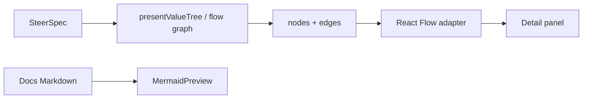

# 0007. Mermaid for docs; React Flow for product graphs

## Context and Problem Statement

SteerCo already renders Mermaid fences in docs/ADRs and briefly used Mermaid for the Lean Value Tree and organisation relationship views. Product graphs now need SteerCo styling, TB/LR layout control, and clickable nodes that open further detail - without pulling ArchLens canvas chrome into the executive surface.

## Decision Drivers

- Hexagonal boundary: pure presenters emit graph models; React stays in adapters/UI
- Executive visual language (tokens, typography) - not generic diagram SVG
- Interactive selection (node → detail panel / deep link) is first-class
- Keep lightweight docs rendering for Markdown ADRs
- Do not share ArchLens canvas packages ([ADR 0004](./0004-suite-relationship-archlens.md))

## Considered Options

- Option A: Extend Mermaid (`themeVariables`, `click` handlers, SVG post-processing) for all product graphs
- Option B: React Flow (`@xyflow/react`) for interactive product graphs; Mermaid remains docs-only
- Option C: Adopt ArchLens canvas / shared diagram kit

## Decision Outcome

Chosen option: **Option B**.

- **Mermaid** stays the renderer for in-app docs and ADR fences (`MermaidPreview`)
- **React Flow** renders product graphs (Lean Value Tree and organisation interaction graph)
- Presenters expose `nodes` / `edges` (+ optional layout positions), never Mermaid strings, for product surfaces
- Optional Mermaid export of the same model may be added later; it is not the interactive surface

### Consequences

- Good, because custom nodes can use SteerCo CSS tokens and real React controls
- Good, because click/keyboard selection and detail panels are ordinary React state
- Good, because docs keep a zero-config diagram path
- Bad, because a second diagram dependency exists alongside Mermaid (accepted; different jobs)
- Bad, because layout must be owned (tree layout or ELK/Dagre later) instead of Mermaid’s defaults

## Architecture sketch

## Links

- [ADR 0002 Tech stack](./0002-tech-stack.md)
- [ADR 0004 Suite relationship with ArchLens](./0004-suite-relationship-archlens.md)
