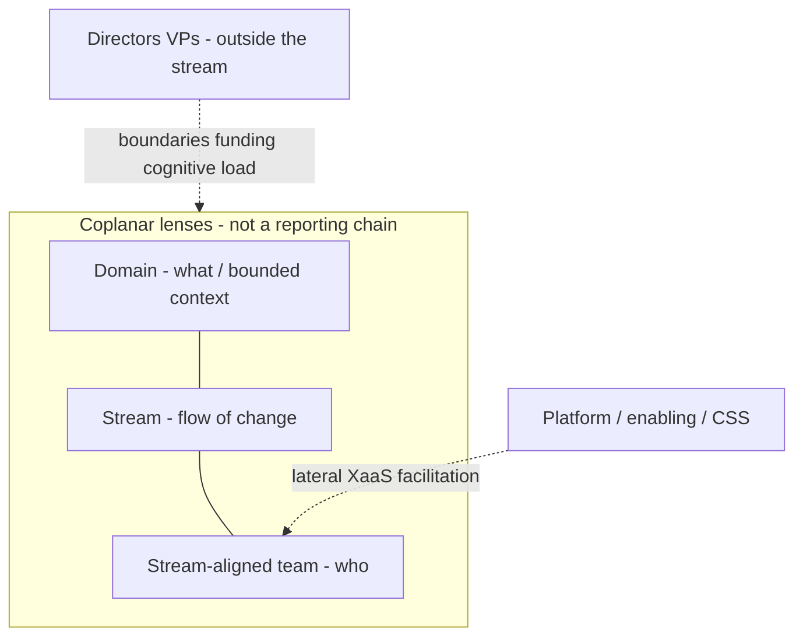

# 0008. Domains, streams, and teams are coplanar lenses

## Context and Problem Statement

Leaders naturally map Team Topologies language onto an org chart: domain → streams → teams as nested management tiers. That recreates handoffs and hides cognitive-load problems when a single “team” grows past trust boundaries. SteerSpec already stores `domains[]`, `streams[]`, and `teams[]`; we need a hard product rule for what those fields mean and how oversized teams should evolve.

## Decision Drivers

- Team Topologies: domain / stream / stream-aligned team are three lenses on one slice of value (what / flow / who), not a reporting hierarchy
- Cognitive load: team complexity rises with size (`n(n-1)/2` communication paths); ~8 people is a healthy default; above ~15 high-trust relationships break down
- Evolution paths for overload: fracture into peer stream-aligned teams, form a platform grouping, or extract a complicated subsystem - never add a “domain manager” tier
- Platform, enabling, and complicated-subsystem teams sit laterally to stream-aligned teams
- Directors / VPs stay outside the delivery stream (HR / strategy / boundary design), not inside the flow graph as a topology type

## Considered Options

- Option A: Treat `domains[]` as managerial parents of streams and teams (hierarchy)
- Option B: Keep schema shape; redefine semantics as coplanar lenses + soft mismatches for size and multi-team streams
- Option C: Collapse domains into stream metadata only (lose vertical filter / related-context labels)

## Decision Outcome

Chosen option: **Option B**.

- **Domain** = problem-space boundary (bounded context / related-context label). Optional UI filter, not a boss.
- **Stream** = end-to-end flow of change inside that boundary.
- **Stream-aligned team** = the people who own that flow.
- Ideal for stream-aligned delivery: one team ↔ one stream ↔ one domain slice. When load is too high, split into peer sub-domains / streams / teams.
- Soft mismatch `team_oversized` when recorded member count reaches the Dunbar trust caution threshold (default 15). Soft mismatch `stream_multi_team` when more than one stream-aligned team shares a stream.
- Copy and Technical vocabulary teach evolution paths and “lenses not hierarchy.”

### Consequences

- Good, because SteerSpec stays additive and sample workspaces keep working
- Good, because mismatches turn size and shared-stream smells into steering prompts with evolution advice
- Good, because domain filters remain useful without implying middle-management boxes
- Bad, because related streams may still share a domain label for filtering - teaching must stress taxonomy ≠ hierarchy
- Bad, because size signals only fire when `members[]` are recorded (capacity is intentional, not HR sync)

## Architecture sketch

## Links

- [Team Topologies: When teams grow too large](https://teamtopologies.com/news-blogs-newsletters/when-teams-grow-too-large-solving-cognitive-load-issues)
- [OPERATING_MODEL_ALIGNMENT.md](../../plan/docs/OPERATING_MODEL_ALIGNMENT.md)
- [F03 How work is organised](../../plan/docs/prds/F03-how-work-is-organised.md)
