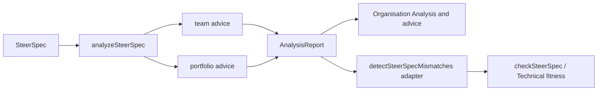

# 0009. Analysis engine for team and portfolio advice

## Context and Problem Statement

Operating-model cues lived as a flat `detectSteerSpecMismatches` list. Leaders need a clearer **analysis engine** that owns recommendations by family - starting with team advice (size, breadth, chatter) and extending to portfolio / LVT advice - without turning SteerCo into an HR or psychometric tool.

## Decision Drivers

- Team Topologies cognitive load: size (~Dunbar), communication paths `n(n-1)/2`, and problem-space breadth
- DDD: breadth across bounded contexts / streams is a fracture-plane signal
- Extensibility: portfolio (goals, bets, MoS) advice should share one report shape
- Backward compatibility: existing CI / presenters still consume a flat mismatch list

## Considered Options

- Option A: Keep growing `detectMismatches.ts` with more codes only
- Option B: Domain `analysis/` engine with `team` and `portfolio` families; mismatches become a thin adapter
- Option C: Separate microservice / ML advice product

## Decision Outcome

Chosen option: **Option B**.

- `analyzeSteerSpec(doc)` returns `{ teams, portfolio, all }`
- Team family includes `team_size`, `team_breadth`, `team_chatter` (+ external collaboration chatter), plus existing topology cues
- Portfolio family holds LVT / bet / goal advice and is the extension point for richer goal fitness later
- `detectSteerSpecMismatches` adapts the report for legacy callers (`team_size` → `team_oversized` alias)

### Consequences

- Good, because advice is family-grouped in the organisation UI
- Good, because thresholds are centralised in `ANALYSIS_DEFAULTS`
- Bad, because two entry points exist briefly (analyze vs detect) - prefer analyze for new UI

## Architecture sketch

## Links

- [ADR 0008](./0008-domain-stream-team-coplanar-lenses.md)
- [OPERATING_MODEL_ALIGNMENT.md](../../plan/docs/OPERATING_MODEL_ALIGNMENT.md)
