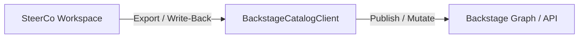

# 0010. Export Backstage Group definitions and contribute to Backstage graph

## Context and Problem Statement

Initially, provider-synced teams were designed as reference-only ([ADR 0005](./0005-provider-teams-reference-only.md)) to avoid duplication and conflicts. However, to maximize the value of SteerCo as an organizational design and alignment tool, users need to be able to export Group definitions configured or enriched within SteerCo back to the Backstage graph.

## Decision Drivers

- Enable SteerCo to act as an active contributor to the organizational graph in Backstage.
- Avoid duplicate manual entry when mapping or restructuring teams within SteerCo.
- Ensure a safe write-back policy that allows exporting definitions while respecting provider mappings.

## Considered Options

- **Option A**: Keep provider-synced teams reference-only (Status Quo from ADR 0005).
- **Option B**: Enable exporting Backstage Group definitions and writing back changes to contribute to the Backstage catalog/graph.

## Decision Outcome

Chosen option: **Option B**, because users want SteerCo to propagate group structure improvements, ownership, and metadata back to the developer portal graph.

### Proposed Request / Sync Flow

### Consequences

- **Good**: SteerCo can now export Group catalog definitions and update the Backstage graph.
- **Good**: Simplifies adoption by allowing team configurations modeled in SteerCo to be directly contributed back.
- **Follow-up**: Implement safe merge previews so users can inspect Group YAML modifications before they are pushed or exported.
