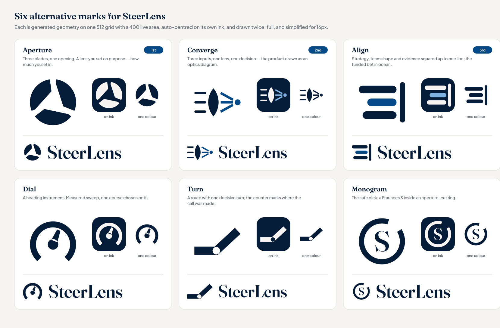
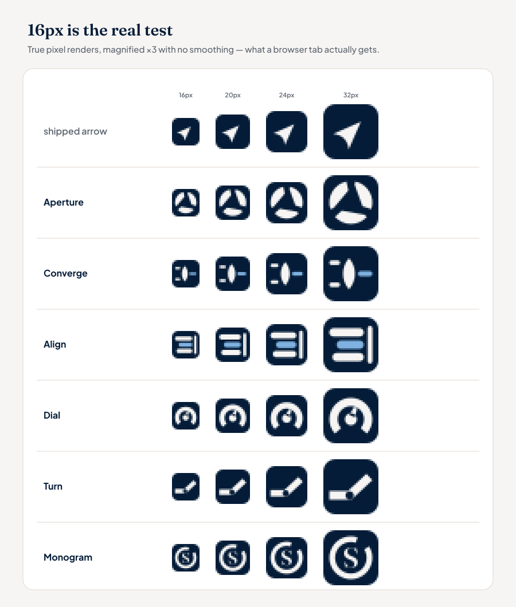
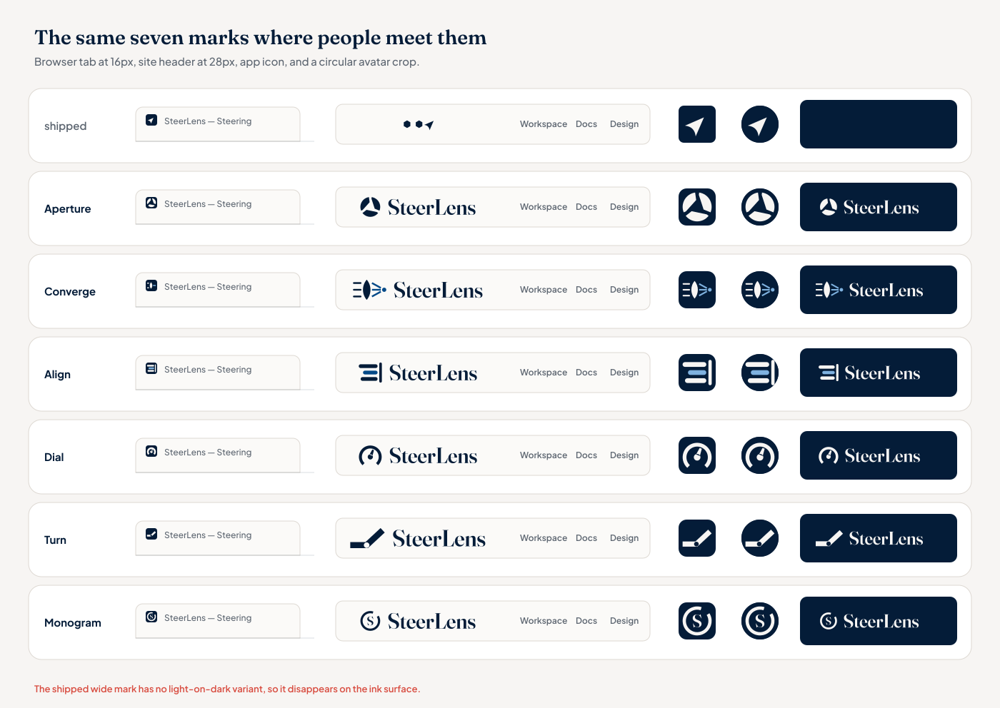
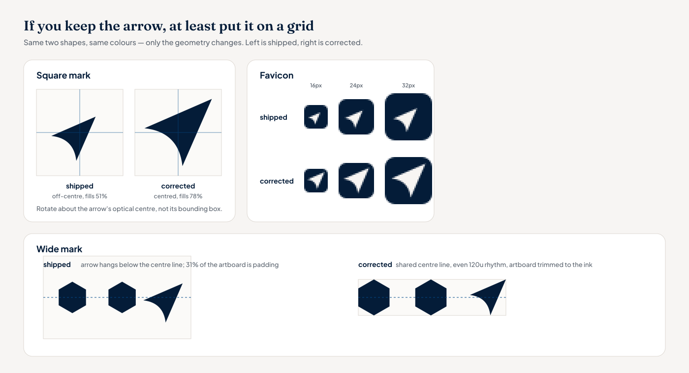

# Logo critique and alternatives — August 2026

An outside read of the shipped identity in `design-pack/`, and six alternative marks drawn as
working files. Nothing here touches the shipped brand; `design-pack/` and `app/public/` are
untouched so this can be evaluated and thrown away without cost.

Contact sheets are in [`contact-sheets/`](./contact-sheets). Every measurement below comes from
rendering the committed SVGs with librsvg and reading the pixels, not from looking at them.

---

## 1. The critique

### 1.1 The square mark is off its own centre

`mark.svg` rotates the arrow −45° about its bounding-box centre rather than its optical centre.
Rendered at 512px the ink lands 37px left and 37px low of the artboard centre — 7.2% of the canvas
on each axis — and covers only 51% of the artboard. In a circular avatar crop the arrow leans into
the bottom-left quadrant with dead space top-right. `favicon.svg` inherits the same 35.5px offset,
and its glyph covers 8.1% of the tile.

### 1.2 The wide mark has no shared centre line

In `mark-lockup.svg` (viewBox 356×200):

| Measurement | Value |
| --- | --- |
| Arrow centre vs hexagon centre line | 13.4u lower |
| Arrow height vs hexagon height | +25% |
| Centre-to-centre rhythm | 120u, then 98.6u |
| Horizontal padding | 37.1u left, 20.1u right |
| Ink band as a share of artboard height | 49% |

That last row is the expensive one. The header renders this at `h-7`, and because 51% of the
artboard is empty padding, only about 14px of actual mark appears in a 28px slot.

### 1.3 There is no mark — there are two marks

The square applications use the arrow alone; the wide lockup uses hexagons plus arrow. The
hexagons never appear anywhere else, so the favicon, the PWA icon, the apple-touch icon and every
avatar carry none of the distinguishing shape. The two assets share no element that a viewer could
carry from one to the other. `mark-lockup.svg` is also not a lockup — there is no wordmark in it,
and no vector wordmark exists anywhere in the pack.

### 1.4 The mark is a cursor

A north-east arrowhead with a scooped base is the most crowded shape in software: it is the Figma
and Sketch pointer, the Google Maps navigation chevron, the Telegram send button. At favicon size
it does not say SteerLens, it says "a cursor". The product is positioned for non-technical
executives, and the one shape carrying the brand is a piece of tool chrome.

### 1.5 Half the name is undrawn

"Steer" gets an arrow. "Lens" gets nothing — no optic, no aperture, no focus, no framing. The
`v12`/`v13` reticle explorations in this folder's siblings were the ones addressing it, and they
were dropped. Meanwhile the hexagons carry borrowed equity from exactly the wrong neighbourhood:
hexagons read as infrastructure and platform tooling, and the README positions SteerLens *against*
Backstage and Jira. Two hexagons in a row also read as an incomplete set; the eye expects a third.

### 1.6 The primary brand colour cannot touch the mark

| Pair | Contrast |
| --- | --- |
| Ink `#041c38` on paper | 15.72:1 |
| Ocean `#044a88` on paper | 8.25:1 |
| **Ocean `#044a88` on ink** | **1.91:1** |

Ocean is declared the primary brand colour but is invisible on the ink surfaces the brand uses for
dark mode, app icons and avatars. That is why the whole pack is monochrome: the ramp has no step
between ink and ocean. A tint around `#7fb2e0` reaches 7.61:1 on ink and unlocks a two-tone mark.

### 1.7 The social card is not a flat asset

`social-share.svg` sets the wordmark as a live text element in Fraunces. Rendered anywhere the font
is not installed — CI, preview tooling, anyone who opens the file — the wordmark falls back to tofu.
See `contact-sheets/audit_social_card_live_text.png`. Distributed artwork has to be outlined.

### 1.8 What a design pack still owes its users

The current README is a file inventory. It does not define clear space, minimum size, the one-colour
version, incorrect usage, or a stacked lockup, and there is no light-on-dark variant of the wide
mark at all — so the wide mark disappears on the ink surfaces the app already uses.

---

## 2. Six alternatives



All six are built from computed geometry on one 512 grid with a 400 live area, auto-centred on
their own ink (largest residual offset across the set: 0.5px at 512), and each ships a `-small` build — the same idea redrawn
with fewer parts and heavier strokes for 16–24px. Each folder contains:

| File | Use |
| --- | --- |
| `icon.svg` | Primary square mark, two-tone |
| `icon-mono.svg` | One-colour version |
| `icon-dark.svg` | Light-on-ink tile |
| `icon-small.svg` | Simplified drawing for small sizes |
| `favicon.svg` | The small drawing on an ink tile |
| `lockup.svg` / `lockup-dark.svg` | Mark plus outlined Fraunces wordmark, artboard trimmed to the ink |

### Aperture — recommended

Three iris blades around a triangular opening. "Lens" made literal, and an aperture is a decision
about how much you let in, which is the product. It is the only concept in the set that is still
completely unambiguous at 16px, it survives a circular crop, and it carries a serif wordmark well.
Risk: apertures are common in photography brands, less so in executive software.

### Converge

Three inputs enter, one lens, one decision — the product drawn as an optics diagram, and the
closest match to "strategy, team shape and evidence, aligned". Best story in the set and the most
distinctive at large sizes. It needs its simplified drawing below about 24px; the full ray fan
collapses.

### Align

Three streams squared up to one line, with the funded bet carrying the accent. The most legible
mark here at any size and the most direct illustration of the tagline. Honest risk: it sits close
to a text-align toolbar icon, and the accent row is doing most of the work keeping it clear of that.

### Dial

A heading instrument — measured sweep, one course chosen on it. Reads as executive dashboard, and
"steer" without a cursor. Risk: gauge and speedometer marks are well worn, and the fine ring gets
soft below 20px.

### Turn

A route that makes one decisive turn, with the counter at the vertex marking where the call was
made. Bold, holds tiny, and is about deciding rather than pointing. Risk: at a glance it can read
as a checkmark or a hinge.

### Monogram

The safe pick: a Fraunces S inside an aperture-cut ring. A letterform is always identifiable, so
this is the lowest-risk option for recognition, and it ties the mark to the display face. It is
also the least distinctive — it says "a company beginning with S".

### Small sizes and context





---

## 3. If the arrow stays

`keep-and-fix/` is not a redesign. It is the shipped shapes with the geometry corrected: the arrow
rotated about its optical centre and scaled to fill 78% of the artboard, the wide mark rebuilt on a
shared centre line with an even 120u rhythm and the artboard trimmed to the ink, plus the
light-on-dark wide variant that does not currently exist.



`wordmark.svg` is "SteerLens" in Fraunces 600 at `opsz` 144, shaped with HarfBuzz and converted to a
single path. It is worth adopting whichever direction wins, because it removes the font dependency
from every distributed asset.

---

## 4. Regenerating

Everything in this folder is generated. Requires `rsvg-convert` (librsvg), plus
`fonttools` and `uharfbuzz`, and Fraunces + Plus Jakarta Sans TTFs in `~/.fonts`
(override with `STEERLENS_FONT_DIR`).

```bash
cd mockups/logo-explorations/alternatives-2026-08/generate
python3 build.py          # the six concepts
python3 keepfix.py        # corrected version of the shipped mark
for s in sheet_audit sheet_alts sheet_keepfix sheet_wordmark; do python3 "$s.py"; done
```

`concepts.py` holds the geometry, one function per idea; `build.py` handles centring, optical
normalisation and the lockups; `paths.py` holds the overridable locations.
