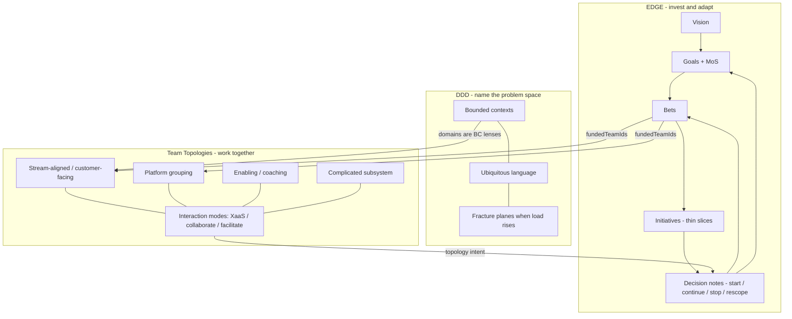

# Operating model alignment - EDGE + Team Topologies + DDD

**Status:** Living product backlog notes (not an ADR)  
**Audience:** Product, design, engineering  
**Captured:** 2026-08-10 · **Refined:** 2026-08-12  
**Purpose:** Preserve how SteerCo should build on [EDGE](https://www.thoughtworks.com/content/dam/thoughtworks/documents/books/bk_EDGE_en.pdf) - a **holistic value-driven operating model** (Lean Value Tree **plus** product mindset, Tech@Core, PVR, integrated backlogs, MoS, and six principles) - [Team Topologies](https://teamtopologies.com/book) (esp. 2nd edition) - and [Domain-Driven Design](https://www.domainlanguage.com/ddd/) (Eric Evans) - so Slice work does not lose the intent.

SteerCo stays an **investment contract + topology intent** surface. It does **not** become Jira, an HR org chart, a tech-radar product, or a full portfolio PMO.

---

## Sources

### EDGE - Value-Driven Digital Transformation

Jim Highsmith, Linda Luu, David Robinson (Addison-Wesley / ThoughtWorks).

| Resource             | URL                                                                                  |
| -------------------- | ------------------------------------------------------------------------------------ |
| Sample chapter (PDF) | https://www.thoughtworks.com/content/dam/thoughtworks/documents/books/bk_EDGE_en.pdf |
| O’Reilly             | https://www.oreilly.com/library/view/edge-value-driven-digital/9780135263617/        |
| Agile Alliance       | https://agilealliance.org/resources/books/edge-value-driven-digital-transformation/  |
| InfoQ Q&A            | https://www.infoq.com/articles/book-edge-value/                                      |

### Team Topologies (2nd edition, 2025)

Matthew Skelton, Manuel Pais (IT Revolution). Subtitle: _Organizing Business and Technology for Fast Flow of Value_. ISBN 9781966280002. Published 23 Sep 2025.

| Resource                       | URL                                                                                                                                                                  |
| ------------------------------ | -------------------------------------------------------------------------------------------------------------------------------------------------------------------- |
| Book page                      | https://teamtopologies.com/book                                                                                                                                      |
| Amazon UK                      | https://www.amazon.co.uk/Team-Topologies-2nd-Organizing-Technology/dp/1966280009                                                                                     |
| 2nd edition newsletter         | https://teamtopologies.com/news-blogs-newsletters/the-second-edition-of-team-topologies-is-now-available                                                             |
| Site / key concepts            | https://teamtopologies.com/                                                                                                                                          |
| IT Revolution product          | https://itrevolution.com/product/team-topologies-second-edition/                                                                                                     |
| Groupings (2e clarification)   | https://teamtopologies.com/key-concepts-content/groupings                                                                                                            |
| Core team types                | https://teamtopologies.com/key-concepts-content/what-are-the-core-team-types-in-team-topologies                                                                      |
| Beyond the machine (2e themes) | https://teamtopologies.com/news-blogs-newsletters/2025/8/27/beyond-the-machine-team-topologies-second-edition-and-the-future-of-humane-high-performing-organizations |
| Oversized teams / cognitive load | https://teamtopologies.com/news-blogs-newsletters/when-teams-grow-too-large-solving-cognitive-load-issues |

### Domain-Driven Design (Eric Evans)

Eric Evans, _Domain-Driven Design: Tackling Complexity in the Heart of Software_ (Addison-Wesley). SteerCo does not replace ArchLens as a software modeler; it uses DDD language so topology intent stays aligned to problem-space boundaries.

| Resource              | URL                                                                 |
| --------------------- | ------------------------------------------------------------------- |
| Domain Language (DDD) | https://www.domainlanguage.com/ddd/                                 |
| Bounded Context      | https://martinfowler.com/bliki/BoundedContext.html                  |
| Ubiquitous Language   | Core DDD practice: shared vocabulary across business and delivery |

**Diagram / trademark note:** Team Topologies branding and book diagrams have usage rules ([use of book diagrams](https://teamtopologies.com/book)). SteerCo should use plain-language topology labels in the executive UI, not copy proprietary TT artwork without permission.

---

## How the three frameworks meet in SteerCo

EDGE shifts organisations from traditional, efficiency-focused planning to **adaptive, value-driven execution**. The Lean Value Tree is the strategy spine; EDGE also supplies product mindset, Tech@Core, Periodic Value Review, integrated backlogs, Measures of Success, and six operating principles. Domain-Driven Design (Eric Evans) answers **where problem-space boundaries sit** (bounded contexts, ubiquitous language). Team Topologies answers **how we organise for fast flow of value** along those boundaries. SteerCo is the steering workspace that keeps the investment contract and topology intent versionable - with a board pack as the shareable export.



| Question                        | SteerCo surface today                         | Build toward                                                                 |
| ------------------------------- | --------------------------------------------- | ---------------------------------------------------------------------------- |
| How should we invest?           | Vision, goals, bets, metrics                  | Full EDGE toolkit: LVT + MoS + product brief + Tech@Core + backlog mix |
| Where are the problem boundaries? | Domain labels on streams                    | Explicit DDD bounded-context teaching; fracture when contexts overload |
| How should we work together?    | How work is organised (zones + relationships) | Full TT types, modes, groupings, cognitive-load signals                      |
| How can we adapt fast enough?   | Kill criteria, evidence, decision notes       | Named Periodic Value Review (PVR) cadence; stop-ready; learn-before-number   |

**One-line thesis:** SteerCo is the lightweight operating surface for EDGE’s full value-driven model, Eric Evans’ Domain-Driven Design (bounded contexts as domain lenses), and Team Topologies’ topology intent: a versionable investment contract, product/tech fitness cues, PVR-style start/stop decisions, and fast-flow org shape - without becoming the system of record for work or an HR org chart.

---

## Part A - EDGE alignments (capture all)

EDGE is a **holistic operating model**, not a single tree diagram. Beyond the Lean Value Tree it supplies product mindset & Product brief, Tech@Core, Periodic Value Review (PVR), Integrated Backlogs, Measures of Success, and six core principles. SteerCo must treat those teachings as first-class product intent-even when a teaching maps to copy, mismatches, and lightweight schema cues rather than a full submodule.

### A0. Already aligned

| EDGE idea                                     | SteerCo today                                        |
| --------------------------------------------- | ------------------------------------------------------ |
| Operating model between strategy and delivery | Steering workspace / SteerSpec investment contract     |
| Goal over output                           | Goals + metrics; bets carry success/kill signals    |
| Value-driven portfolio (LVT)                  | Product: vision → goals → bets; schema: `vision` → `outcomes` → `bets` |
| Lightweight governance                        | Decision notes: start / continue / stop / rescope      |
| Measures of Success (partial)                 | Goal metrics; bet ↔ MoS links (Slice 1.5)           |
| How we work (partial)                         | Topology zones + relationship modes                    |
| Adapt fast enough (partial)                   | Kill criteria, `stop_ready`, evidence, mismatches      |

### A0b. Primary EDGE tools beyond the LVT (first-class map)

| EDGE teaching                         | Meaning                                                                                         | SteerCo today                                      | Build toward (stay investment-contract, not PMO)                                                                 |
| ------------------------------------- | ----------------------------------------------------------------------------------------------- | ---------------------------------------------------- | ---------------------------------------------------------------------------------------------------------------- |
| **Six core principles**               | Cultural OS that makes the tools work                                                           | Implicit in copy                                     | Explicit principles in glossary / docs / Technical mode; UX reinforces autonomy + value prioritization           |
| **Product mindset & Product brief** | Long-lived product teams; lightweight product definition linked to LVT                        | Bets + funded teams                                  | Optional Product brief linked to goals/bets; teaching copy: product ≠ project                             |
| **Tech@Core**                         | Technology as business engine; strategic tech debt; Tech Radar                                  | Capability bets; ArchLens suite link (later)         | Tech-debt / revitalize cues on capability bets; optional radar _refs_ (not a radar product)                      |
| **Lightweight governance & PVR**      | Replace stage-gate / annual budget theatre with frequent, data-informed portfolio rebalancing   | Decision notes + bet `reviewDate` / horizon          | Name PVR in product language; steering “next review” ritual; double-down vs defund without bureaucracy           |
| **Integrated Backlogs**               | Cross-prioritise strategic + BAU + maintenance + capability work with relative value/effort     | `fundingStance` explore/exploit/sustain; no dual backlog | Portfolio mix / stance cues; relative value rank; never own Jira execution backlog                             |
| **Measures of Success (MoS)**         | Customer-value fitness function; leading vs lagging; tied to Goals/Bets                         | Goals MoS + bet links                             | Keep deepening: decision notes cite MoS; leading/lagging framing; fitness over efficiency                       |
| **Lean Value Tree**                   | Vision → Goals → Bets → Initiatives                                                             | Vision / goals (`outcomes[]`) / bets             | Optional initiatives; Technical mode notes schema `outcomes[]` = Goals                                                      |

```mermaid
flowchart TB
  principles[Six EDGE principles]
  subgraph tools [EDGE primary tools]
    lvt[Lean Value Tree]
    productBrief[Product brief]
    techcore[Tech@Core]
    pvr[Periodic Value Review]
    backlog[Integrated Backlogs]
    mos[Measures of Success]
  end
  principles --> tools
  lvt --> mos
  productBrief --> lvt
  techcore --> lvt
  backlog --> lvt
  mos --> pvr
  pvr -->|start continue stop rescope| lvt
```

### A1. Name the LVT ladder

EDGE tree: **Vision → Goals → Bets → Initiatives**.

| Action                    | Detail                                                                                                                       |
| ------------------------- | ---------------------------------------------------------------------------------------------------------------------------- |
| Product / UI words        | Use `Goal` and `Bet` (LVT ladder) - not “Outcome” as the primary label                                                       |
| Glossary / Technical mode | Goal is canonical; schema field remains `outcomes[]` until migrated; Bet ≈ Bet; optional Initiative ≈ thin slice under a bet |
| Schema (later)            | Optional `initiatives[]` with `betId`, title, successSignal - **not** a Jira backlog (one sentence + optional external link) |

Without initiatives, “delivery” only appears as funded teams (topology), not value slicing.

### A2. Measures of Success as first-class

EDGE MoS shape work and fund decisions; they are the **customer-value fitness function**, not after-the-fact KPIs or industrial-era efficiency metrics (cost/schedule alone).

| Action              | Detail                                                                                            |
| ------------------- | ------------------------------------------------------------------------------------------------- |
| Require MoS         | Each goal ≥1 MoS with baseline / current / target / interpretation                             |
| Leading vs lagging  | Prefer leading indicators that steer bets; lagging MoS validate - label both in Technical mode |
| Bet ↔ MoS           | Bet detail shows which MoS the bet is meant to move (beyond free-text success signal)             |
| Mismatch            | `bet_without_mos_link` (or weak link)                                                             |
| Decision notes / PVR | Prefer measured lines that cite MoS ids                                                          |
| Copy cue            | “These measures define what we’re willing to pay for-not a status dashboard.”                     |

### A3. Customer value (fitness) vs ROI (constraint)

| Action           | Detail                                                                                  |
| ---------------- | --------------------------------------------------------------------------------------- |
| Primary framing  | Goals stay customer-external                                                         |
| Secondary        | Optional `investmentGuardrails` (budget band, capacity) on bets - never the hero metric |
| Steering summary | Lead with goal movement and stop-ready bets; cost quiet if shown                     |

### A4. “How we invest” as a steering ritual

| Field / cue                                 | Why                                   |
| ------------------------------------------- | ------------------------------------- |
| Bet horizon / next review date              | Incremental funding / PVR checkpoint  |
| Funding stance: explore / exploit / sustain | Envision–Explore vs BAU / sustain     |
| WIP limit on active bets                    | Focus; adapt fast enough              |
| Rank or relative value order                | Value-based prioritization            |
| Capability vs opportunity bet               | Build the ability vs chase the market |

Mismatch ideas: too many concurrent `on_track` bets; explore bets with no kill/review date; orphan capability work with no customer MoS.

### A5. Delivery stays EDGE-shaped, not Jira-shaped

| Do                                                     | Don’t                                     |
| ------------------------------------------------------ | ----------------------------------------- |
| Funded teams + focus under each bet                    | Dual backlog / epic trees                 |
| Soft rule: one primary bet per stream-aligned team     | Story points / % complete in executive UI |
| Thin-slice initiatives as narrative toward MoS (later) | Sprint boards                             |

### A6. “Adapt fast enough” as Periodic Value Review (PVR)

EDGE replaces annual budgeting and heavy stage-gate steering with **Periodic Value Review**: leaders regularly review active bets, look at MoS/evidence, and **double down or defund** without bureaucratic friction.

| SteerCo surface                         | PVR role                                                              |
| ----------------------------------------- | --------------------------------------------------------------------- |
| Bet `reviewDate` / horizon                | Next PVR checkpoint                                                   |
| Steering overview “next review” strip     | Portfolio rebalancing agenda                                          |
| Elevate `stop_ready`                      | Defund candidates visible before vanity green status                  |
| Evidence: “What did we learn?” first      | Data-informed, not stage-gate theatre                                 |
| Decision notes start/continue/stop/rescope | The PVR decision artifact                                           |
| Board pack: **Invest / Work / Adapt**     | One page per EDGE question after the review                           |

Do **not** build a PMO workflow engine; keep PVR as a named ritual on top of decision notes + MoS.

### A7. Glossary / schema hygiene

| Today                            | EDGE-aligned tweak                                                      |
| -------------------------------- | ----------------------------------------------------------------------- |
| `kind: SteerTree`                | Keep; document as Lean Value Tree contract (spine of EDGE, not all of EDGE) |
| `outcomes`                       | Product language: **Goal**. Schema key remains `outcomes[]` until a migration                           |
| `successSignal` + `killCriteria` | Keep; kill criteria = pre-agreed stop rule for incremental funding / PVR |
| Missing `initiatives`            | Add only when value-slice visibility is needed without owning execution |
| Decision notes                   | Document as the lightweight PVR decision record                         |

### A8. Product mindset & Product brief

EDGE shifts from a **project** mindset (temporary teams; on-time/on-budget) to a **product** mindset (long-lived teams; continuous value). The **Product brief** is a lightweight definition of a product: core elements, LVT linkage, and customer problems solved-without heavy upfront requirements.

| Action                         | Detail                                                                                          |
| ------------------------------ | ----------------------------------------------------------------------------------------------- |
| Teaching copy                  | Executive empty states / glossary: products outlive projects; topology funds products, not Gantt |
| Optional schema                | `products[]`: problem, customers, LVT links, non-goals - few fields |
| Linkage                        | Brief points at goals/MoS/bets; never a requirements PRD dump                            |
| Topology join                  | Stream-aligned teams own products end-to-end (Team Topologies); enabling/platform support them  |
| Out of product-brief scope | Sprint roadmaps, feature catalogs, dual backlog                                                  |

### A9. Tech@Core

EDGE treats technology as the **core engine of the business**, not a back-office cost centre. Strategic **tech debt** is a first-class investment concern; a **Tech Radar** helps monitor and adapt to technology trends.

| Action                      | Detail                                                                                                 |
| --------------------------- | ------------------------------------------------------------------------------------------------------ |
| Capability bets             | Prefer `kind: capability` + MoS when revitalising core systems (debt paydown must move a fitness measure) |
| Copy / steering cues        | “Tech debt is a business bet-or it isn’t funded”                                                       |
| ArchLens suite link (later) | Deferred deep link to architecture risk - Tech@Core evidence, not a second canvas in-chrome |
| Tech Radar                  | Optional external radar _reference_ / link in Technical mode or evidence - **do not** build a radar UI |
| Mismatch ideas (later)      | Capability bet with no MoS; sustain-only portfolio with rising risk evidence                           |

### A10. Integrated Backlogs (steering mix, not Jira)

A common failure mode is funding only innovation while ignoring BAU, maintenance, and capability building. EDGE’s **Integrated Backlog** cross-prioritises strategic (LVT-derived) work with BAU, maintenance, and capability using **relative value and effort**-without collapsing into a single execution tool.

| Action                    | Detail                                                                                         |
| ------------------------- | ---------------------------------------------------------------------------------------------- |
| Funding stance            | Keep `explore` \| `exploit` \| `sustain` as the exec-facing mix signal                         |
| Portfolio mix hint (later)| Steering shows approximate mix of opportunity vs capability vs sustain - calm cue, not finance |
| Relative value stack          | Drag-to-reorder portfolio stack on bets (top = highest; dense valueRank under the hood) |
| External work links       | Later: annotate Jira (or similar) refs - **never** import/own the execution backlog            |
| Explicit non-goal         | Full BAU vs strategic finance / ROI accounting (EDGE Ch.7 numbers) - guardrails only if shown  |

### A11. Six core EDGE principles (cultural OS)

Tools fail without the principles. SteerCo should make these visible in docs, Technical mode, and calm UX cues-not as a poster wall in the executive hero.

| Principle                                   | SteerCo expression                                                              |
| ------------------------------------------- | --------------------------------------------------------------------------------- |
| **Outcome-based strategy**                  | Goals + MoS before output; bets judged by fitness movement                     |
| **Value-based prioritization**              | Rank / WIP / stance; do the most valuable work first                              |
| **Lightweight planning and governance**     | Decision notes + PVR cadence; no stage-gate theatre                               |
| **Adaptive, learning culture**              | Evidence “what did we learn?”; stop/rescope without stigma                        |
| **Autonomous teams**                        | Topology intent funds long-lived teams; SteerCo doesn’t micromanage delivery    |
| **Self-sufficient, collaborative decisions**| Push start/stop decisions to people closest to the work; board pack shares, not dictates |

### A12. Explicitly out of scope from EDGE

- Full BAU vs strategic portfolio **finance** accounting (EDGE Ch.7 spreadsheets) - stance/mix cues only
- Building a Tech Radar product or tech-debt inventory system (refs + capability bets only)
- Prescriptive scaling ceremony - stay principle-led
- Replacing delivery tooling / owning integrated execution backlogs - stop at the investment contract
- Heavy product brief / requirements documentation - keep briefs lightweight or omit

### A13. EDGE priority order

1. MoS ↔ bet linkage + decision-note measured refs (**customer-value fitness**)
2. Name and ritualise **PVR** on review dates + stop-ready + decision notes
3. Incremental-funding cues on bets (horizon, explore/exploit/sustain, WIP)
4. Explicit LVT + **six principles** + Product / Tech@Core vocabulary in docs/glossary/Technical mode
5. Product brief (lightweight) linked to LVT - when product-vs-project confusion shows up
6. Integrated backlog **mix / relative value** cues (not Jira)
7. Optional initiatives under bets
8. Board pack structured on EDGE’s three questions (Invest / Work / Adapt) - keep
9. Tech@Core: capability-bet cues + optional ArchLens / radar refs
10. Capability vs opportunity portfolio mix (polish)

---

## Part B - Team Topologies alignments (esp. 2nd edition)

### B0. Already aligned

| TT idea                          | SteerCo today                                      |
| -------------------------------- | ---------------------------------------------------- |
| Delivery topology ≠ HR org chart | Product principle + F03                              |
| Stream-aligned                   | `team.role: stream_aligned`                          |
| Platform                         | `team.role: platform`                                |
| Enabling                         | `team.role: enabling`                                |
| Complicated subsystem            | `team.role: complicated_subsystem`                   |
| X-as-a-Service                   | `uses_as_service`                                    |
| Collaboration                    | `works_together`                                     |
| Facilitation                     | `coaching`                                           |
| Platform overload as signal      | `platform_overload` mismatch (default ≥8 dependents) |
| Intent over static org chart     | Topology _intent_ in SteerSpec                       |

### B1. Second-edition themes to absorb

From [teamtopologies.com/book](https://teamtopologies.com/book), the [Sep 2025 newsletter](https://teamtopologies.com/news-blogs-newsletters/the-second-edition-of-team-topologies-is-now-available), and [IT Revolution](https://itrevolution.com/product/team-topologies-second-edition/):

| 2e theme                                               | Meaning for SteerCo                                                                                                      |
| ------------------------------------------------------ | -------------------------------------------------------------------------------------------------------------------------- |
| **Clearly articulated intent and purpose**             | Topology and bets are _intent_ artifacts leaders evolve-not a frozen org chart export                                      |
| **Cognitive load as a design principle**               | Surface load drivers (dependencies, bet thrash, platform fan-in); calm mismatches, not vanity org polish                   |
| **Organisations as ecosystems, not machines**          | Prefer flourishing / flow language over efficiency-centralisation language in exec copy                                    |
| **Platform = platform grouping**                       | A “platform” may be many teams with a shared purpose-not one box. Schema/UI must allow platform _groupings_                |
| **Value stream grouping**                              | Optional grouping of stream-aligned teams around a common value stream / business domain (TT term for “teams under a domain”) |
| **Fractal design**                                     | Same patterns at multiple zoom levels (e.g. stream-aligned teams _inside_ a platform grouping)                             |
| **Evolutionary, not static**                           | Interaction modes and roles change over time; support history via SteerSpec/git, not one-shot “reorg done”                 |
| **Whole-organisation / multi-portfolio applicability** | Keep language business+tech; avoid “IT reorg tool” framing                                                                 |
| **Fast flow of value**                                 | Primary success of org shape = faster value to customers (ties to EDGE MoS)                                                |
| **Inter-team problems as signals**                     | Mismatches and odd relationships are steering inputs for decision notes                                                    |
| **Thinnest Viable Platform (TVP)**                     | Platform purpose = reduce load on stream-aligned teams; warn when platform grows without load reduction                    |
| **AI / cognitive load**                                | Later: overloaded topology + AI productivity without boundary redesign = wasted ROI (product narrative, not a feature yet) |

### B2. Four team types (complete the model)

Current SteerSpec has three roles. TT has **four** fundamental types:

| TT type               | SteerCo today         | Suggested evolution                                                                                                                         |
| --------------------- | ----------------------- | ------------------------------------------------------------------------------------------------------------------------------------------- |
| Stream-aligned        | `stream_aligned`        | Zone title “Stream-aligned teams”; own goals end-to-end                                                                                  |
| Platform (grouping)   | `platform`              | Support **platform grouping** later (parent grouping + member teams)                                                                        |
| Enabling              | `enabling`              | Facilitation mode default; temporary boost, not permanent owner                                                                             |
| Complicated subsystem | `complicated_subsystem` | Specialist expertise that would overload stream-aligned teams                                                                               |
| Complicated subsystem | _Missing_               | Add `complicated_subsystem` (exec: “Specialist subsystem”) - rare, high-complexity domain owned by specialists so stream teams stay focused |

### B3. Three interaction modes (language + semantics)

| TT mode        | SteerSpec today   | Notes                                                                                                     |
| -------------- | ----------------- | --------------------------------------------------------------------------------------------------------- |
| X-as-a-Service | `uses_as_service` | Default for stream → platform; low ongoing interaction cost                                               |
| Collaboration  | `works_together`  | Time-bounded discovery; encourage `expectedUntil` / review date so collab doesn’t become permanent muddle |
| Facilitation   | `coaching`        | Enabling → stream; temporary capability uplift                                                            |

Suggested mismatch/warnings:

- Collaboration with no end/review date
- Enabling team permanently listed as delivery owner of a bet (should facilitate, not own forever)
- Stream team with no XaaS path to platform capabilities it depends on (hidden handoffs)

### B4. Groupings, scope, and flow-of-change layout (2e)

Flat “four type zones” teach vocabulary but do not scale past a handful of teams. At ~20 teams across many domains, the **spine is stream-aligned teams** owning flows of change; platform, enabling, and complicated-subsystem teams are **lateral** support for that flow - not peer columns of equal weight, and not managers above streams.

**Domains, streams, and teams are coplanar lenses - not a hierarchy** ([ADR 0008](../../docs/ADRs/0008-domain-stream-team-coplanar-lenses.md)):

| Lens | Meaning | SteerSpec |
| ---- | ------- | --------- |
| **Domain** (what) | Problem-space / bounded-context boundary | `domains[]` labels related streams for filters - never a managerial parent |
| **Stream** (flow) | End-to-end flow of change inside that slice | `streams[]` |
| **Stream-aligned team** (who) | People empowered to deliver that flow | `teams[]` with `role: stream_aligned` + ideally one `streamId` |

Ideal: **one stream-aligned team ↔ one stream ↔ one domain slice**. When a vertical is too large for one team’s cognitive load, **fracture into peer sub-domains** (each with its own stream and team) - do not invent a “Domain Team” that manages several “Stream Teams.” Platform, enabling, and complicated-subsystem teams remain beside the spine (XaaS / facilitation), not above it. Directors and VPs sit **outside** the delivery stream: they redesign boundaries, fund platforms/enablers, and watch load - they are not a topology type.

In Team Topologies 2e, “organise teams under a domain” maps to related **value-stream** slices sharing a context label; a multi-team platform maps to a **platform grouping**. Platforms also have an **audience scope**: organisation-wide, vertical (related streams), or dedicated to a single stream-aligned team. Complicated-subsystem teams sit **in** a stream (specialty beside the stream team). Enabling teams **fan out** via facilitation to many streams.

```yaml
# Illustrative - not yet in v1alpha1
groupings:
  - name: fulfilment-platform
    kind: platform # platform | value_stream
    title: Fulfilment platform
    # Audience for platform groupings (also allowed on leaf platform teams)
    platformScope: organisation # organisation | vertical | team
    members: [team:fulfilil-api, team:fulfilil-data]
  - name: checkout
    kind: value_stream
    title: Checkout # business domain / value stream label in exec UI
    members: [team:checkout-web, team:checkout-pricing]
teams:
  - name: multil-api
    role: platform
    platformScope: organisation
  - name: checkout-web
    role: stream_aligned
  - name: checkout-pricing
    role: complicated_subsystem
    # Nest CSS inside a stream (team-within-team); grouping membership alone is not enough for layout
    within: team:checkout-web
  - name: flow-coaches
    role: enabling
relationships:
  - from: team:checkout-web
    to: team:fulfilil-api
    mode: x_as_a_service
  - from: team:flow-coaches
    to: team:checkout-web
    mode: facilitation
    expectedUntil: '2026-12-31'
```

**Executive UI (scale layout):** a **flow-of-change canvas** - value streams left-to-right toward the customer; stream-aligned teams as the primary bands; platforms drawn by scope (org / vertical / team); complicated subsystem nested inside its stream; enabling teams beside the streams they facilitate. Four type zones remain a **teaching / filter** layer (empty state, glossary, Technical mode), not the only layout at scale.

**Bet / project overlay:** on bet detail (and optionally steering), show which teams sit on the flow for that bet as of a date - funded streams plus related platform / CSS / enabling edges - without becoming a delivery Gantt.

**Point-in-time:** org view projects teams, members, relationships, and mismatches **as of** a selected date (default today); deep history stays on the [F13](./prds/F13-topology-timeline.md) timeline.

Do not copy proprietary Team Topologies book diagrams; derive visuals from SteerSpec using our own shapes library (geometry already in core vocabulary).

### B5. Cognitive load signals (productised mismatches)

Do **not** build a full psychometric survey in Slice 1. Do encode **steering-visible** load proxies:

| Signal                           | Idea                                                                                          |
| -------------------------------- | --------------------------------------------------------------------------------------------- |
| Platform fan-in                  | Existing `platform_overload` - retarget copy to cognitive load / flow, not “too many friends” |
| Bet thrash                       | Stream team funded on many active bets                                                        |
| Collaboration tax                | Too many concurrent `works_together` edges                                                    |
| Missing enablement               | At-risk stream teams with no enabling relationship                                            |
| Fractal overload                 | Platform grouping with too many internal members _and_ external dependents                    |
| Team size / complexity           | Analysis engine `team_size` (legacy mismatch alias `team_oversized`) when recorded members ≥ ~15 (Dunbar high-trust caution; ~8 is healthy). Headline cites communication paths `n(n-1)/2` and evolution paths - never hard HR enforcement |
| Team breadth                     | Analysis engine `team_breadth` when a team spans multiple streams / domains (too many problem spaces) |
| Team chatter                     | Analysis engine `team_chatter` / `team_chatter_external` when within-team paths or collaboration edges are high |
| Shared stream                    | Soft `stream_multi_team` when more than one stream-aligned team owns the same stream - prefer peer domain/stream splits |

**Evolution paths when a team or domain slice is overloaded** ([TT newsletter on oversized teams](https://teamtopologies.com/news-blogs-newsletters/when-teams-grow-too-large-solving-cognitive-load-issues)):

1. Form independent stream-aligned teams on peer sub-domains / streams
2. Form a platform grouping (X-as-a-Service) so streams shed shared complexity
3. Extract a complicated-subsystem team for deep specialty

Decision-note prompt: “What load are we removing for stream-aligned teams?”

### B6. Fast flow ↔ EDGE MoS

Team Topologies optimises **flow of value**; EDGE defines **what value is**. Join them:

- Stream-aligned teams should map cleanly to bets that move customer MoS
- Platform groupings judged by whether dependents move MoS faster / with less coordination cost
- Stop/rescope when topology intent cannot deliver the MoS (not when a project plan slips)
- Bet detail can overlay **who is in the flow** for that funded work (stream + scoped supports) alongside MoS - still intent, not a project plan

### B7. Copy and empty states (F03)

Empty / teaching states should reflect 2e language without trademark overload:

- Four **purposes** of teams, not “departments” - stream-aligned is the core of delivery flow
- Relationships as **how work flows**, not reporting lines
- Platform exists to **reduce load** on stream-aligned teams; scope may be org, vertical, or single-team
- Enabling coaches many teams; complicated subsystem nests inside a stream when specialty would overload it
- Shape **evolves**; the map is a **point-in-time** intent for this steering period (as-of control on the org view)

### B8. Explicitly out of scope from Team Topologies

- Full cognitive-load assessment instrument (Weis model / 20+ drivers) as a product module
- Replacing IdP / HR systems of record
- Animating official TT book diagrams without permission
- Prescribing a single “correct” org for every customer

### B9. Team Topologies priority order

1. Exec copy + glossary: stream-aligned / platform grouping / enabling / cognitive load / fast flow
2. Retarget `platform_overload` messaging to load + flow
3. Time-box collaboration relationships (`expectedUntil`)
4. Schema: `complicated_subsystem` role
5. Schema: `groupings` (platform + value_stream) + fractal membership; `platformScope`; CSS `within` nest
6. Soft “one primary bet per stream team” mismatch
6b. Soft `team_oversized` + `stream_multi_team`; teach domain/stream/team as coplanar lenses ([ADR 0008](../../docs/ADRs/0008-domain-stream-team-coplanar-lenses.md))
6c. Analysis engine owns team advice (size / breadth / chatter) and portfolio/LVT advice ([ADR 0009](../../docs/ADRs/0009-analysis-engine-team-portfolio-advice.md)); large-org sample demonstrates intentional smells
7. Org view **flow-of-change** layout (streams as spine) + as-of date; type zones as teaching/filter
8. Bet flow overlay (funded teams + related interactions as of date)
9. Board-pack “Work” page: topology intent + load signals + recommended interaction changes
10. Topology timeline: capacity deltas + relationship spans over time ([F13](./prds/F13-topology-timeline.md)) — landed (Organisation **Timeline** view)

### B10. Leadership sits outside the stream (HR ≠ topology)

Engineering Directors and VPs still have line management, budget, and career paths. That **HR reporting structure is not the delivery topology**.

| Leadership job in SteerCo | Not their job in the flow graph |
| ------------------------- | ------------------------------- |
| Keep strategy, team shape, and evidence aligned (EDGE + TT) | Hand requirements down a domain → stream → team chain |
| Sense cognitive load; find **fracture planes**; split overloaded bounded contexts into peer sub-domains | Act as a permanent approval gate inside the stream |
| Sponsor / fund platform and enabling teams when many streams share the same drag | Dictate paved-road usage as a hierarchy above streams |
| Drive the **Inverse Conway Maneuver** - reshape teams and interaction modes so the desired architecture can emerge | Sit on the organisation canvas as a topology type |

Stream-aligned teams are the **customers** of platform and enabling teams (XaaS / facilitation). Platform does not manage streams; it offers a compelling internal product that reduces load.

---

## Part C - Domain-Driven Design alignments (Eric Evans)

SteerCo utilises and aligns to Eric Evans’ Domain-Driven Design. It does **not** become a full DDD modeling tool (that stays closer to ArchLens / code). It does make DDD vocabulary first-class so leaders draw team boundaries on **problem-space** lines.

### C0. Already aligned (implicit → make explicit)

| DDD idea              | SteerCo today                                                                 |
| --------------------- | ----------------------------------------------------------------------------- |
| Bounded context       | `domains[]` as the “what” lens; titles should use business language           |
| Ubiquitous language   | Glossary + Technical vocabulary; Goal / Bet / MoS / stream-aligned naming     |
| Context boundaries    | Soft mismatches when one team owns many streams or many teams share one stream |
| Strategic design join | Team Topologies stream-aligned ownership of a context slice end-to-end        |

### C1. How DDD maps onto SteerSpec

| DDD term                 | SteerSpec / product meaning                                                                                          |
| ------------------------ | -------------------------------------------------------------------------------------------------------------------- |
| **Bounded context**      | A `domains[]` entry is a problem-space fence (concepts + rules). Containment is taxonomic, like a BC around a service - **not** a manager over teams |
| **Ubiquitous language**  | Domain, stream, and team **titles** should match how the business talks - not org-chart labels (“Digital squad 4”) |
| **Sub-domain / fracture**| When cognitive load rises, split the context into peer sub-domains (each with its own stream + stream-aligned team) |
| **Context map (light)**  | Interaction modes + relationships are the steering-visible map of how contexts collaborate - not a full DDD context-map product |
| **Anti-corruption**      | Import/merge and external refs stay at the adapter edge; SteerSpec never dual-owns IdP Groups                         |

### C2. Explicitly out of scope from DDD (in SteerCo)

- Full tactical DDD modeling (aggregates, entities, repositories) as a product surface - keep that in code / ArchLens
- Generating microservices or context maps as engineering CAD
- Replacing domain experts’ workshops - SteerCo records the resulting boundary intent

### C3. DDD priority order

1. Name domains as **bounded contexts** in glossary, product guide, Technical vocabulary, and F03 teaching
2. Keep domain/stream/team coplanar (ADR 0008) with BC containment analogy
3. Fracture-plane / peer sub-domain evolution copy on oversized and multi-team mismatches
4. Optional later: short `domains[].summary` for problem-space language (still not a DDD wiki)

---

## Part D - Combined backlog (do not lose)

**Slice commitments:** checklist items below are scheduled in [ROADMAP.md](./ROADMAP.md) (Slice 1 copy → Slice 1.5 schema → Slice 3 groupings/initiatives). Tick here when implemented in product; keep rationale sections above.

### D1. Near-term (Slice 1 - copy / presentation)

- [x] Document LVT mapping in [PRODUCT_SPEC.md](./PRODUCT_SPEC.md) glossary (Goal is LVT canonical; schema `outcomes[]`; MoS; Initiative reserved)
- [x] Document TT mapping in glossary (roles ↔ types; modes ↔ interactions; platform grouping note)
- [x] Commit Slice 1 operating-model bar + Slice 1.5/3 in [ROADMAP.md](./ROADMAP.md); amend PRDs F02–F08, F12
- [x] MoS framing on Goals page; bet detail shows related Goal MoS as context
- [x] Decision note helper copy prefers MoS / evidence language
- [x] F03 / steering copy: cognitive load, fast flow, platform reduces load; overload banner wording
- [x] Elevate stop-ready in steering alignment summary
- [x] Board pack outline: Invest / Work / Adapt sections ([F08](./prds/F08-export-board-pack.md))
- [x] Document full EDGE toolkit beyond LVT (principles, Product brief, Tech@Core, PVR, Integrated Backlogs, MoS) in product glossary + in-app docs
- [x] Name decision notes / review cadence as **Periodic Value Review (PVR)** in product guide and F07/F02 copy (executive-safe: “value review”, Technical mode: PVR)
- [x] Technical mode / glossary: six EDGE principles + product-vs-project teaching
- [x] Document DDD (Eric Evans): domains ≈ bounded contexts; ubiquitous language; fracture planes; leadership outside the stream

### D2. Schema / core (Slice 1.5 - additive)

- [x] Canonical Team Topologies team types (`stream_aligned` \| `platform` \| `enabling` \| `complicated_subsystem`) + legacy alias parse
- [x] Canonical interaction modes (`x_as_a_service` \| `collaboration` \| `facilitation`) + legacy alias parse
- [x] `teams[].members[]` with `discipline` + job `title` + `ftePercent` (capacity / mix signal)
- [x] Discipline-mix mismatches / advice (e.g. stream-aligned team missing product FTE) - soft capacity cues, not staffing policy
- [x] `bets[].metricIds[]` or `primaryMetricId`
- [x] `bets[].reviewDate` / `horizon`
- [x] `bets[].fundingStance`: `explore` \| `exploit` \| `sustain`
- [x] `bets[].kind`: `opportunity` \| `capability` (optional)
- [x] `relationships[].expectedUntil` (collaboration / facilitation time-box)
- [x] Member / relationship `effectiveFrom`–`effectiveUntil` windows (capacity + interaction history toward [F13](./prds/F13-topology-timeline.md))
- [x] Optional `topologyEvents[]` ledger (capacity up/down, relationship added/ended/mode-changed)
- [x] New mismatch codes: `bet_without_mos_link`, `collab_without_end`, `stream_bet_wip`, `enabling_owns_delivery`, `stream_missing_product`, `team_oversized`, `team_size`, `team_breadth`, `team_chatter`, `stream_multi_team`
- [x] Decision notes prefer structured MoS refs in `measured` (keep free text)
- [x] Member edit UX on organisation page

### D3. Later (Slice 3+)

- [x] `groupings[]` with `kind: platform | value_stream` and kinded `members[]` (team refs) - value-stream groupings = teams under a shared business domain / value stream; platform groupings = teams under a shared platform purpose
- [x] `platformScope` on platform teams and platform groupings: `organisation | vertical | team` (who the platform accelerates)
- [x] Complicated-subsystem nest: optional `within` (team ref to stream-aligned parent) and/or membership in a value-stream grouping for team-within-team layout
- [x] Soft mismatches when reality breaks ideals (e.g. stream-aligned on multiple streams; multiple stream-aligned teams on one stream; team size ≥ ~15)
- [x] Domain / stream / team taught as coplanar lenses (what / flow / who), not a reporting hierarchy ([ADR 0008](../../docs/ADRs/0008-domain-stream-team-coplanar-lenses.md))
- [x] DDD (Eric Evans) named as foundational alignment: domains ≈ bounded contexts; leadership outside the stream; stream-aligned teams as customers of platform/enabling; Inverse Conway / fracture-plane teaching in docs + Technical vocabulary
- [x] Enabling one-to-many: present facilitation fan-out as expected; keep `enabling_owns_delivery` mismatch
- [x] Org view **flow-of-change canvas** (streams as spine; platforms by scope; CSS nested; enabling beside dependents) - type zones remain teaching/filter
- [x] **As-of date on org view** - project teams / members / relationships / mismatches at selected date (default today)
- [x] Bet / project **flow overlay** - funded teams + related interactions for that bet as of date ([F04](./prds/F04-bet-detail.md))
- [x] Optional `initiatives[]` under bets
- [x] WIP / rank UI for value-based prioritization (Integrated Backlog relative value)
- [x] Portfolio mix hint: opportunity vs capability vs sustain (Integrated Backlog stance mix - not finance)
- [x] Optional lightweight **Product brief** (`products[]` linked to goals/bets)
- [x] Tech@Core cues: capability-bet revitalize copy; optional external Tech Radar link (no radar UI)
- [ ] MoS leading vs lagging label (Technical mode / schema docs)
- [ ] Fractal zoom on org view (grouping → members)
- [x] **Topology timeline view ([F13](./prds/F13-topology-timeline.md))** - capacity deltas + relationship spans; deep-dive scrubber (org view keeps lightweight as-of)
- [ ] ArchLens suite link deferred (no SteerSpec field yet)
- [ ] Narrative tie-in: AI gains without topology redesign stall in bottlenecks (press / docs only until evidence exists)
- [x] Technical mode ([F12](./prds/F12-technical-mode.md)): Steer tree, topology fitness + write-back policy, EDGE / DDD / TT vocabulary bridge
- [x] Catalog-file import & merge ([F11](./prds/F11-import-merge.md)) without OAuth; never proposes Group YAML
- [ ] Connections / OAuth UI ([F10](./prds/F10-connections.md))

---

## Part E - SteerSpec vocabulary bridge

| SteerSpec (exec)                     | EDGE                        | DDD (Evans)                              | Team Topologies                               |
| ------------------------------------ | --------------------------- | ---------------------------------------- | --------------------------------------------- |
| `metadata` / workspace title         | Portfolio / steering period / PVR window | -                                 | Intent for this period                 |
| `spec.vision`                        | Vision                      | Shared direction language                | Purpose / direction                           |
| `outcomes` + `metrics`               | Goals + Measures of Success (fitness function) | Goal language in ubiquitous terms | Value definition that flow should serve |
| `bets`                               | Bets (product / Tech@Core investments) | Funded change inside contexts     | Funded work streams for stream/platform teams |
| `bets[].fundingStance`               | Integrated Backlog mix cue (explore/exploit/sustain) | -                            | Capacity focus                     |
| `bets[].kind`                        | Opportunity vs capability (Tech@Core revitalize) | -                               | -                                       |
| `bets[].reviewDate` / `horizon`      | PVR / incremental funding checkpoint | -                               | -                                       |
| `products[]`                           | Product brief           | Product language in the domain           | Stream-aligned product ownership              |
| `initiatives`                        | Initiatives                 | Thin slices (not backlog items)          | Thin slices (not backlog items)               |
| `domains[]`                          | Vertical / related-context filter | **Bounded context** (problem-space fence) | Domain lens (what) - not a manager |
| `streams[]`                          | -                           | Flow of change inside a context          | Stream lens (flow)                            |
| `teams` + `role`                     | Delivery capacity / product teams | Who owns the context slice        | Team types; size is a cognitive-load signal |
| `groupings`                          | -                           | -                                        | Platform groupings only (lateral support) |
| `platformScope` / CSS in stream      | -                           | Specialty inside / beside a context      | Platform audience; complicated subsystem beside stream team |
| Flow-of-change + as-of               | Who delivers this bet when  | Context ownership over time              | Point-in-time topology intent                 |
| `relationships` + `mode`             | How we work                 | Light context collaboration cues         | Interaction modes                             |
| Capacity / topology windows          | Delivery capacity over time | -                                        | Shape evolves; collaboration time-boxed       |
| `topologyEvents`                     | What changed in the period  | Boundary / ownership changes             | Evidence for adapt / load response            |
| `decisionNotes`                      | Lightweight governance / PVR decision record | Fracture / re-scope decisions   | Response to flow/load signals        |
| `evidence`                           | Feedback for adapt / PVR    | Learning that changes funding or shape   | Learning that changes funding or shape        |
| Optional Tech Radar link             | Tech@Core sensing           | -                                        | -                                             |
| Mismatches                           | Portfolio smells            | Context overload / shared-stream smells  | Cognitive-load / interaction smells           |
| Docs: six principles                 | Cultural OS for EDGE tools  | Complements clear domain language        | Complements fast-flow culture                 |

---

## Related product docs

- [PRODUCT_SPEC.md](./PRODUCT_SPEC.md) - domain glossary and principles
- [STEER_SPEC.md](./STEER_SPEC.md) - canonical contract
- [ROADMAP.md](./ROADMAP.md) - slices
- [F02](./prds/F02-steering-overview.md) · [F03](./prds/F03-how-work-is-organised.md) · [F04](./prds/F04-bet-detail.md) · [F05](./prds/F05-goals.md) · [F06](./prds/F06-evidence.md) · [F07](./prds/F07-decision-note.md) · [F08](./prds/F08-export-board-pack.md)
- [ADR 0008](../../docs/ADRs/0008-domain-stream-team-coplanar-lenses.md) - domains / streams / teams as coplanar lenses

When a checklist item graduates into committed Slice work, add or amend a PRD and tick it here - do not delete the rationale sections above.
