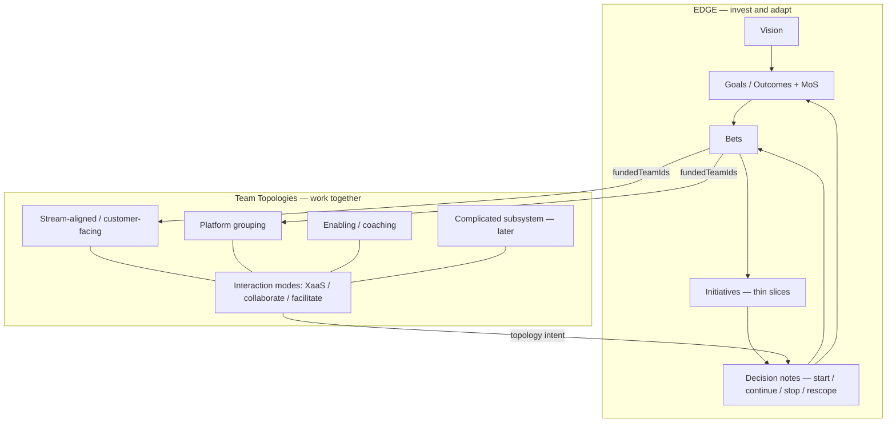

# Operating model alignment — EDGE + Team Topologies

**Status:** Living product backlog notes (not an ADR)  
**Audience:** Product, design, engineering  
**Captured:** 2026-08-10  
**Purpose:** Preserve how SteerLens should build on [EDGE](https://www.thoughtworks.com/content/dam/thoughtworks/documents/books/bk_EDGE_en.pdf) (Lean Value Tree / value-driven portfolio) and [Team Topologies](https://teamtopologies.com/book) (esp. 2nd edition), so Slice work does not lose the intent.

SteerLens stays an **investment contract + topology intent** surface. It does **not** become Jira, an HR org chart, or a full portfolio PMO.

---

## Sources

### EDGE — Value-Driven Digital Transformation

Jim Highsmith, Linda Luu, David Robinson (Addison-Wesley / ThoughtWorks).

| Resource             | URL                                                                                  |
| -------------------- | ------------------------------------------------------------------------------------ |
| Sample chapter (PDF) | https://www.thoughtworks.com/content/dam/thoughtworks/documents/books/bk_EDGE_en.pdf |
| O’Reilly             | https://www.oreilly.com/library/view/edge-value-driven-digital/9780135263617/        |
| Agile Alliance       | https://agilealliance.org/resources/books/edge-value-driven-digital-transformation/  |
| InfoQ Q&A            | https://www.infoq.com/articles/book-edge-value/                                      |

### Team Topologies (2nd edition, 2025)

Matthew Skelton, Manuel Pais (IT Revolution). Subtitle: _Organizing Business and Technology for Fast Flow of Value_. ISBN 9781966280002. Published 23 Sep 2025.

| Resource                       | URL                                                                                                                                                                  |
| ------------------------------ | -------------------------------------------------------------------------------------------------------------------------------------------------------------------- |
| Book page                      | https://teamtopologies.com/book                                                                                                                                      |
| Amazon UK                      | https://www.amazon.co.uk/Team-Topologies-2nd-Organizing-Technology/dp/1966280009                                                                                     |
| 2nd edition newsletter         | https://teamtopologies.com/news-blogs-newsletters/the-second-edition-of-team-topologies-is-now-available                                                             |
| Site / key concepts            | https://teamtopologies.com/                                                                                                                                          |
| IT Revolution product          | https://itrevolution.com/product/team-topologies-second-edition/                                                                                                     |
| Groupings (2e clarification)   | https://teamtopologies.com/key-concepts-content/groupings                                                                                                            |
| Core team types                | https://teamtopologies.com/key-concepts-content/what-are-the-core-team-types-in-team-topologies                                                                      |
| Beyond the machine (2e themes) | https://teamtopologies.com/news-blogs-newsletters/2025/8/27/beyond-the-machine-team-topologies-second-edition-and-the-future-of-humane-high-performing-organizations |

**Diagram / trademark note:** Team Topologies branding and book diagrams have usage rules ([use of book diagrams](https://teamtopologies.com/book)). SteerLens should use plain-language topology labels in the executive UI, not copy proprietary TT artwork without permission.

---

## How the two frameworks meet in SteerLens

EDGE answers **how we invest** and **how we adapt funding**. Team Topologies answers **how we organise for fast flow of value**. SteerLens is the steering workspace that keeps both contracts versionable — with a board pack as the shareable export.



| EDGE question                 | SteerLens surface today                         | Build toward                                              |
| ----------------------------- | ----------------------------------------------- | --------------------------------------------------------- |
| How should we invest?         | Vision, outcomes, bets, metrics                 | Explicit LVT + MoS linkage + incremental funding cues     |
| How should we work together?  | How work is organised (3 zones + relationships) | Full TT types, modes, groupings, cognitive-load signals   |
| How can we adapt fast enough? | Kill criteria, evidence, decision notes         | Review cadence, stop-ready elevation, learn-before-number |

**One-line thesis:** SteerLens is the lightweight operating surface for EDGE’s strategy→delivery gap and Team Topologies’ topology intent: a versionable Lean Value Tree plus fast-flow org shape and stop decisions—without becoming the system of record for work.

---

## Part A — EDGE alignments (capture all)

### A0. Already aligned

| EDGE idea                                     | SteerLens today                                        |
| --------------------------------------------- | ------------------------------------------------------ |
| Operating model between strategy and delivery | Steering workspace / SteerSpec investment contract |
| Outcome over output                           | Outcomes + metrics; bets carry success/kill signals    |
| Value-driven portfolio (LVT)                  | `vision` → `outcomes` → `bets` in `steertree.yaml`     |
| Lightweight governance                        | Decision notes: start / continue / stop / rescope      |
| How we work (partial)                         | Topology zones + relationship modes                    |
| Adapt fast enough (partial)                   | Kill criteria, `stop_ready`, evidence, mismatches      |

### A1. Name the LVT ladder (keep exec language plain)

EDGE tree: **Vision → Goals → Bets → Initiatives**.

| Action                    | Detail                                                                                                                       |
| ------------------------- | ---------------------------------------------------------------------------------------------------------------------------- |
| UI words                  | Keep `Outcome` and `Bet` for executives                                                                                      |
| Glossary / Technical mode | Map Outcome ≈ Goal; Bet ≈ Bet; optional Initiative ≈ thin slice under a bet                                                  |
| Schema (later)            | Optional `initiatives[]` with `betId`, title, successSignal — **not** a Jira backlog (one sentence + optional external link) |

Without initiatives, “delivery” only appears as funded teams (topology), not value slicing.

### A2. Measures of Success as first-class

EDGE MoS shape work and fund decisions; they are not after-the-fact KPIs.

| Action         | Detail                                                                                |
| -------------- | ------------------------------------------------------------------------------------- |
| Require MoS    | Each outcome ≥1 MoS with baseline / current / target / interpretation                 |
| Bet ↔ MoS      | Bet detail shows which MoS the bet is meant to move (beyond free-text success signal) |
| Mismatch       | `bet_without_mos_link` (or weak link)                                                 |
| Decision notes | Prefer measured lines that cite MoS ids                                               |
| Copy cue       | “These measures define what we’re willing to pay for—not a status dashboard.”         |

### A3. Customer value (fitness) vs ROI (constraint)

| Action           | Detail                                                                                  |
| ---------------- | --------------------------------------------------------------------------------------- |
| Primary framing  | Outcomes stay customer-external                                                         |
| Secondary        | Optional `investmentGuardrails` (budget band, capacity) on bets — never the hero metric |
| Steering summary | Lead with outcome movement and stop-ready bets; cost quiet if shown                     |

### A4. “How we invest” as a steering ritual

| Field / cue                                 | Why                                   |
| ------------------------------------------- | ------------------------------------- |
| Bet horizon / next review date              | Incremental funding checkpoint        |
| Funding stance: explore / exploit / sustain | Envision–Explore vs BAU               |
| WIP limit on active bets                    | Focus; adapt fast enough              |
| Rank or relative value order                | Value-based prioritization            |
| Capability vs opportunity bet               | Build the ability vs chase the market |

Mismatch ideas: too many concurrent `on_track` bets; explore bets with no kill/review date; orphan capability work with no customer MoS.

### A5. Delivery stays EDGE-shaped, not Jira-shaped

| Do                                                     | Don’t                                     |
| ------------------------------------------------------ | ----------------------------------------- |
| Funded teams + focus under each bet                    | Dual backlog / epic trees                 |
| Soft rule: one primary bet per stream-aligned team     | Story points / % complete in executive UI |
| Thin-slice initiatives as narrative toward MoS (later) | Sprint boards                             |

### A6. “Adapt fast enough” as an explicit loop

- Steering overview: “Last decision / next review” strip
- Elevate `stop_ready` in alignment summary
- Evidence: “What did we learn?” before “What is the number?”
- Board pack: one page per EDGE question — **Invest / Work / Adapt**

### A7. Glossary / schema hygiene

| Today                            | EDGE-aligned tweak                                                      |
| -------------------------------- | ----------------------------------------------------------------------- |
| `kind: SteerTree`                | Keep; document as Lean Value Tree contract                              |
| `outcomes`                       | Alias “Goals” in Technical mode / schema docs                           |
| `successSignal` + `killCriteria` | Keep; kill criteria = pre-agreed stop rule for incremental funding      |
| Missing `initiatives`            | Add only when value-slice visibility is needed without owning execution |

### A8. Explicitly out of scope from EDGE

- Full BAU vs strategic portfolio accounting (EDGE Ch.7) — hint at mix later; no finance module
- Prescriptive scaling ceremony — stay principle-led
- Replacing delivery tooling — stop at the investment contract

### A9. EDGE priority order

1. MoS ↔ bet linkage + decision-note measured refs
2. Incremental-funding cues on bets (horizon, explore/exploit, WIP)
3. Explicit LVT vocabulary in docs/glossary
4. Optional initiatives under bets
5. Board pack structured on EDGE’s three questions
6. Capability vs opportunity + portfolio mix (polish)

---

## Part B — Team Topologies alignments (esp. 2nd edition)

### B0. Already aligned

| TT idea                          | SteerLens today                                      |
| -------------------------------- | ---------------------------------------------------- |
| Delivery topology ≠ HR org chart | Product principle + F03                              |
| Stream-aligned                   | `team.role: stream_aligned`                          |
| Platform                         | `team.role: platform`                                |
| Enabling                         | `team.role: enabling`                                |
| Complicated subsystem            | `team.role: complicated_subsystem`                   |
| X-as-a-Service                   | `uses_as_service`                                    |
| Collaboration                    | `works_together`                                     |
| Facilitation                     | `coaching`                                           |
| Platform overload as signal      | `platform_overload` mismatch (default ≥8 dependents) |
| Intent over static org chart     | Topology _intent_ in SteerSpec                       |

### B1. Second-edition themes to absorb

From [teamtopologies.com/book](https://teamtopologies.com/book), the [Sep 2025 newsletter](https://teamtopologies.com/news-blogs-newsletters/the-second-edition-of-team-topologies-is-now-available), and [IT Revolution](https://itrevolution.com/product/team-topologies-second-edition/):

| 2e theme                                               | Meaning for SteerLens                                                                                                      |
| ------------------------------------------------------ | -------------------------------------------------------------------------------------------------------------------------- |
| **Clearly articulated intent and purpose**             | Topology and bets are _intent_ artifacts leaders evolve—not a frozen org chart export                                      |
| **Cognitive load as a design principle**               | Surface load drivers (dependencies, bet thrash, platform fan-in); calm mismatches, not vanity org polish                   |
| **Organisations as ecosystems, not machines**          | Prefer flourishing / flow language over efficiency-centralisation language in exec copy                                    |
| **Platform = platform grouping**                       | A “platform” may be many teams with a shared purpose—not one box. Schema/UI must allow platform _groupings_                |
| **Value stream grouping**                              | Optional grouping of stream-aligned teams around a common value stream / business domain (TT term for “teams under a domain”) |
| **Fractal design**                                     | Same patterns at multiple zoom levels (e.g. stream-aligned teams _inside_ a platform grouping)                             |
| **Evolutionary, not static**                           | Interaction modes and roles change over time; support history via SteerSpec/git, not one-shot “reorg done”                 |
| **Whole-organisation / multi-portfolio applicability** | Keep language business+tech; avoid “IT reorg tool” framing                                                                 |
| **Fast flow of value**                                 | Primary success of org shape = faster value to customers (ties to EDGE MoS)                                                |
| **Inter-team problems as signals**                     | Mismatches and odd relationships are steering inputs for decision notes                                                    |
| **Thinnest Viable Platform (TVP)**                     | Platform purpose = reduce load on stream-aligned teams; warn when platform grows without load reduction                    |
| **AI / cognitive load**                                | Later: overloaded topology + AI productivity without boundary redesign = wasted ROI (product narrative, not a feature yet) |

### B2. Four team types (complete the model)

Current SteerSpec has three roles. TT has **four** fundamental types:

| TT type               | SteerLens today         | Suggested evolution                                                                                                                         |
| --------------------- | ----------------------- | ------------------------------------------------------------------------------------------------------------------------------------------- |
| Stream-aligned        | `stream_aligned`        | Zone title “Stream-aligned teams”; own outcomes end-to-end                                                                                  |
| Platform (grouping)   | `platform`              | Support **platform grouping** later (parent grouping + member teams)                                                                        |
| Enabling              | `enabling`              | Facilitation mode default; temporary boost, not permanent owner                                                                             |
| Complicated subsystem | `complicated_subsystem` | Specialist expertise that would overload stream-aligned teams                                                                               |
| Complicated subsystem | _Missing_               | Add `complicated_subsystem` (exec: “Specialist subsystem”) — rare, high-complexity domain owned by specialists so stream teams stay focused |

### B3. Three interaction modes (language + semantics)

| TT mode        | SteerSpec today   | Notes                                                                                                     |
| -------------- | ----------------- | --------------------------------------------------------------------------------------------------------- |
| X-as-a-Service | `uses_as_service` | Default for stream → platform; low ongoing interaction cost                                               |
| Collaboration  | `works_together`  | Time-bounded discovery; encourage `expectedUntil` / review date so collab doesn’t become permanent muddle |
| Facilitation   | `coaching`        | Enabling → stream; temporary capability uplift                                                            |

Suggested mismatch/warnings:

- Collaboration with no end/review date
- Enabling team permanently listed as delivery owner of a bet (should facilitate, not own forever)
- Stream team with no XaaS path to platform capabilities it depends on (hidden handoffs)

### B4. Groupings, scope, and flow-of-change layout (2e)

Flat “four type zones” teach vocabulary but do not scale past a handful of teams. At ~20 teams across many domains, the **spine is stream-aligned teams inside value stream groupings**; platform, enabling, and complicated-subsystem teams are scoped support for that flow — not peer columns of equal weight.

In Team Topologies 2e, “organise teams under a domain” maps to a **value stream grouping**; a multi-team platform maps to a **platform grouping**. Platforms also have an **audience scope**: organisation-wide, vertical (one value stream), or dedicated to a single stream-aligned team. Complicated-subsystem teams nest **inside** a value stream (team-within-a-team). Enabling teams **fan out** via facilitation to many streams.

```yaml
# Illustrative — not yet in v1alpha1
groupings:
  - name: fulfilment-platform
    kind: platform # platform | value_stream
    title: Fulfilment platform
    # Audience for platform groupings (also allowed on leaf platform teams)
    platformScope: organisation # organisation | vertical | team
    members: [team:fulfilil-api, team:fulfilil-data]
  - name: checkout
    kind: value_stream
    title: Checkout # business domain / value stream label in exec UI
    members: [team:checkout-web, team:checkout-pricing]
teams:
  - name: multil-api
    role: platform
    platformScope: organisation
  - name: checkout-web
    role: stream_aligned
  - name: checkout-pricing
    role: complicated_subsystem
    # Nest CSS inside a stream (team-within-team); grouping membership alone is not enough for layout
    within: team:checkout-web
  - name: flow-coaches
    role: enabling
relationships:
  - from: team:checkout-web
    to: team:fulfilil-api
    mode: x_as_a_service
  - from: team:flow-coaches
    to: team:checkout-web
    mode: facilitation
    expectedUntil: '2026-12-31'
```

**Executive UI (scale layout):** a **flow-of-change canvas** — value streams left-to-right toward the customer; stream-aligned teams as the primary bands; platforms drawn by scope (org / vertical / team); complicated subsystem nested inside its stream; enabling teams beside the streams they facilitate. Four type zones remain a **teaching / filter** layer (empty state, glossary, Technical mode), not the only layout at scale.

**Bet / project overlay:** on bet detail (and optionally steering), show which teams sit on the flow for that bet as of a date — funded streams plus related platform / CSS / enabling edges — without becoming a delivery Gantt.

**Point-in-time:** org view projects teams, members, relationships, and mismatches **as of** a selected date (default today); deep history stays on the [F13](./prds/F13-topology-timeline.md) timeline.

Do not copy proprietary Team Topologies book diagrams; derive visuals from SteerSpec using our own shapes library (geometry already in core vocabulary).

### B5. Cognitive load signals (productised mismatches)

Do **not** build a full psychometric survey in Slice 1. Do encode **steering-visible** load proxies:

| Signal                           | Idea                                                                                          |
| -------------------------------- | --------------------------------------------------------------------------------------------- |
| Platform fan-in                  | Existing `platform_overload` — retarget copy to cognitive load / flow, not “too many friends” |
| Bet thrash                       | Stream team funded on many active bets                                                        |
| Collaboration tax                | Too many concurrent `works_together` edges                                                    |
| Missing enablement               | At-risk stream teams with no enabling relationship                                            |
| Fractal overload                 | Platform grouping with too many internal members _and_ external dependents                    |
| Size heuristic (later, optional) | Soft warning near Dunbar trust boundary for a single team — never hard HR enforcement         |

Decision-note prompt: “What load are we removing for stream-aligned teams?”

### B6. Fast flow ↔ EDGE MoS

Team Topologies optimises **flow of value**; EDGE defines **what value is**. Join them:

- Stream-aligned teams should map cleanly to bets that move customer MoS
- Platform groupings judged by whether dependents move MoS faster / with less coordination cost
- Stop/rescope when topology intent cannot deliver the MoS (not when a project plan slips)
- Bet detail can overlay **who is in the flow** for that funded work (stream + scoped supports) alongside MoS — still intent, not a project plan

### B7. Copy and empty states (F03)

Empty / teaching states should reflect 2e language without trademark overload:

- Four **purposes** of teams, not “departments” — stream-aligned is the core of delivery flow
- Relationships as **how work flows**, not reporting lines
- Platform exists to **reduce load** on stream-aligned teams; scope may be org, vertical, or single-team
- Enabling coaches many teams; complicated subsystem nests inside a stream when specialty would overload it
- Shape **evolves**; the map is a **point-in-time** intent for this steering period (as-of control on the org view)

### B8. Explicitly out of scope from Team Topologies

- Full cognitive-load assessment instrument (Weis model / 20+ drivers) as a product module
- Replacing IdP / HR systems of record
- Animating official TT book diagrams without permission
- Prescribing a single “correct” org for every customer

### B9. Team Topologies priority order

1. Exec copy + glossary: stream-aligned / platform grouping / enabling / cognitive load / fast flow
2. Retarget `platform_overload` messaging to load + flow
3. Time-box collaboration relationships (`expectedUntil`)
4. Schema: `complicated_subsystem` role
5. Schema: `groupings` (platform + value_stream) + fractal membership; `platformScope`; CSS `within` nest
6. Soft “one primary bet per stream team” mismatch
7. Org view **flow-of-change** layout (streams as spine) + as-of date; type zones as teaching/filter
8. Bet flow overlay (funded teams + related interactions as of date)
9. Board-pack “Work” page: topology intent + load signals + recommended interaction changes
10. Topology timeline: capacity deltas + relationship spans over time ([F13](./prds/F13-topology-timeline.md))

---

## Part C — Combined backlog (do not lose)

**Slice commitments:** checklist items below are scheduled in [ROADMAP.md](./ROADMAP.md) (Slice 1 copy → Slice 1.5 schema → Slice 3 groupings/initiatives). Tick here when implemented in product; keep rationale sections above.

### C1. Near-term (Slice 1 — copy / presentation)

- [x] Document LVT mapping in [PRODUCT_SPEC.md](./PRODUCT_SPEC.md) glossary (Outcome ≈ Goal; MoS; Initiative reserved)
- [x] Document TT mapping in glossary (roles ↔ types; modes ↔ interactions; platform grouping note)
- [x] Commit Slice 1 operating-model bar + Slice 1.5/3 in [ROADMAP.md](./ROADMAP.md); amend PRDs F02–F08, F12
- [x] MoS framing on outcomes page; bet detail shows related outcome MoS as context
- [x] Decision note helper copy prefers MoS / evidence language
- [x] F03 / steering copy: cognitive load, fast flow, platform reduces load; overload banner wording
- [x] Elevate stop-ready in steering alignment summary
- [x] Board pack outline: Invest / Work / Adapt sections ([F08](./prds/F08-export-board-pack.md))

### C2. Schema / core (Slice 1.5 — additive)

- [x] Canonical Team Topologies team types (`stream_aligned` \| `platform` \| `enabling` \| `complicated_subsystem`) + legacy alias parse
- [x] Canonical interaction modes (`x_as_a_service` \| `collaboration` \| `facilitation`) + legacy alias parse
- [x] `teams[].members[]` with `discipline` + job `title` + `ftePercent` (capacity / mix signal)
- [x] Discipline-mix mismatches / advice (e.g. stream-aligned team missing product FTE) — soft capacity cues, not staffing policy
- [x] `bets[].metricIds[]` or `primaryMetricId`
- [x] `bets[].reviewDate` / `horizon`
- [x] `bets[].fundingStance`: `explore` \| `exploit` \| `sustain`
- [x] `bets[].kind`: `opportunity` \| `capability` (optional)
- [x] `relationships[].expectedUntil` (collaboration / facilitation time-box)
- [x] Member / relationship `effectiveFrom`–`effectiveUntil` windows (capacity + interaction history toward [F13](./prds/F13-topology-timeline.md))
- [x] Optional `topologyEvents[]` ledger (capacity up/down, relationship added/ended/mode-changed)
- [x] New mismatch codes: `bet_without_mos_link`, `collab_without_end`, `stream_bet_wip`, `enabling_owns_delivery`, `stream_missing_product`
- [x] Decision notes prefer structured MoS refs in `measured` (keep free text)
- [x] Member edit UX on organisation page

### C3. Later (Slice 3+)

- [ ] `groupings[]` with `kind: platform | value_stream` and kinded `members[]` (team refs) — value-stream groupings = teams under a shared business domain / value stream; platform groupings = teams under a shared platform purpose
- [ ] `platformScope` on platform teams and platform groupings: `organisation | vertical | team` (who the platform accelerates)
- [ ] Complicated-subsystem nest: optional `within` (team ref to stream-aligned parent) and/or membership in a value-stream grouping for team-within-team layout
- [ ] Enabling one-to-many: present facilitation fan-out as expected; keep `enabling_owns_delivery` mismatch
- [ ] Org view **flow-of-change canvas** (streams as spine; platforms by scope; CSS nested; enabling beside dependents) — type zones remain teaching/filter
- [ ] **As-of date on org view** — project teams / members / relationships / mismatches at selected date (default today)
- [ ] Bet / project **flow overlay** — funded teams + related interactions for that bet as of date ([F04](./prds/F04-bet-detail.md))
- [ ] Optional `initiatives[]` under bets
- [ ] WIP / rank UI for value-based prioritization
- [ ] Fractal zoom on org view (grouping → members)
- [ ] **Topology timeline view ([F13](./prds/F13-topology-timeline.md))** — capacity deltas + relationship spans; deep-dive scrubber (org view keeps lightweight as-of)
- [ ] Capability vs opportunity portfolio mix hint
- [ ] ArchLens `systemRefs` on bets stay optional (suite link, not TT)
- [ ] Narrative tie-in: AI gains without topology redesign stall in bottlenecks (press / docs only until evidence exists)

---

## Part D — SteerSpec vocabulary bridge

| SteerSpec (exec)                     | EDGE                        | Team Topologies                               |
| ------------------------------------ | --------------------------- | --------------------------------------------- |
| `metadata` / workspace title         | Portfolio / steering period | Intent for this period                        |
| `spec.vision`                        | Vision                      | Purpose / direction                           |
| `outcomes` + `metrics`               | Goals + Measures of Success | Value definition that flow should serve       |
| `bets`                               | Bets                        | Funded work streams for stream/platform teams |
| `initiatives` (future)               | Initiatives                 | Thin slices (not backlog items)               |
| `teams` + `role`                     | Delivery capacity           | Team types (incl. complicated subsystem)      |
| `groupings` (future)                 | —                           | Platform + value-stream groupings (domain org; fractal) |
| `platformScope` / CSS `within` (future) | —                        | Platform audience; complicated subsystem nest |
| Flow-of-change + as-of (future UI)   | Who delivers this bet when  | Point-in-time topology intent                 |
| `relationships` + `mode`             | How we work                 | Interaction modes                             |
| Capacity / topology windows          | Delivery capacity over time | Shape evolves; collaboration time-boxed       |
| `topologyEvents`                     | What changed in the period  | Evidence for adapt / load response            |
| `decisionNotes`                      | Lightweight governance      | Response to flow/load signals                 |
| `evidence`                           | Feedback for adapt          | Learning that changes funding or shape        |
| Mismatches                           | Portfolio smells            | Cognitive-load / interaction smells           |

---

## Related product docs

- [PRODUCT_SPEC.md](./PRODUCT_SPEC.md) — domain glossary and principles
- [STEER_SPEC.md](./STEER_SPEC.md) — canonical contract
- [ROADMAP.md](./ROADMAP.md) — slices
- [F02](./prds/F02-steering-overview.md) · [F03](./prds/F03-how-work-is-organised.md) · [F04](./prds/F04-bet-detail.md) · [F05](./prds/F05-outcomes.md) · [F06](./prds/F06-evidence.md) · [F07](./prds/F07-decision-note.md) · [F08](./prds/F08-export-board-pack.md)

When a checklist item graduates into committed Slice work, add or amend a PRD and tick it here—do not delete the rationale sections above.
